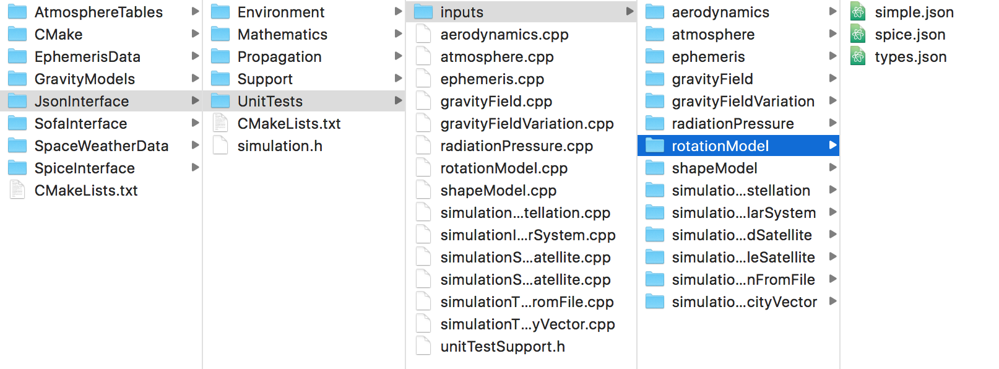

.. _extendingJSON_unitTesting:

.. role:: jsontype
.. role:: jsonkey

Unit testing
============

Three types of tests have been conceived for the JSON Interface: JSON-enhancement tests, in which the features added to the `JSON for Modern C++ <https://github.com/nlohmann/json/>`_ library are tested; component tests, in which the conversion from/to JSON of individual setting objects is performed, without actually using the object that is created; and integration tests, in which all the components are integrated together and full propagations are actually run, both using JSON files and manually writing C++ code, and their results compared.

JSON-enhancement tests
~~~~~~~~~~~~~~~~~~~~~~

All the features added to the JSON library are currently being tested in different test cases of the test suite :literal:`test_json_deserialization`, defined in the file :class:`Tudat/JsonInterface/UnitTests/unitTestDeserialization.cpp`. There are no specific guidelines on how to write the tests for pieces of code that extend the functionality of the JSON library being used. Even if more Tudat features are added to the JSON Interface in the future, it is likely that no additional JSON-enhancement features will have to be added, so there will be no need to write additional tests.

Component tests
~~~~~~~~~~~~~~~

Each component test is designed to exhaustively test all the features of a given settings-container class (and its derived classes). In these tests, it is checked that objects created by reading a JSON file are identical to the objects created manually by writing C++ code. In order to compare the created objects, it will be necessary to define a comparison operator for each settings class in Tudat. Fortunately, this has been done indirectly by writing :literal:`to_json` methods, so we can compare the JSON representation of the created objects rather than the objects themselves. The only drawbacks of this approach are:

  - It cannot be followed for classes storing information that is not convertible to JSON (such as :class:`std::function`).
  - An error in the :literal:`to_json` function can lead to overlooking of errors in the :literal:`from_json` functions.

The first point has little relevance, since classes that cannot be represented as JSON are not supported by the JSON Interface. The second point is more important. Consider these :literal:`to_json` and :literal:`from_jsom` functions:

.. code-block:: cpp
  :linenos:

  void to_json( nlohmann::json& jsonObject, const std::shared_ptr< BodyShapeSettings >& bodyShapeSettings )
  {
      ...
      std::shared_ptr< OblateSphericalBodyShapeSettings > oblateSphericalBodyShapeSettings =
        boost::dynamic_pointer_cast< OblateSphericalBodyShapeSettings >( bodyShapeSettings );
      assertNonNullPointer( oblateSphericalBodyShapeSettings );
      
      jsonObject[ K::equatorialRadius ] = oblateSphericalBodyShapeSettings->getEquatorialRadius( );
      jsonObject[ K::flattening ] = oblateSphericalBodyShapeSettings->getFlattening( );
      ...
  }

  void from_json( const nlohmann::json& jsonObject, std::shared_ptr< BodyShapeSettings >& bodyShapeSettings )
  {
      ...
      bodyShapeSettings = std::make_shared< OblateSphericalBodyShapeSettings >(
        getValue< double >( jsonObject, K::equatorialRadius ),
        getValue< double >( jsonObject, K::flattening ) );
      ...
  }

Now, imagine that we forget line 9 and additionally we have:

.. code-block:: cpp

  bodyShapeSettings = std::make_shared< OblateSphericalBodyShapeSettings >(
    getValue< double >( jsonObject, K::equatorialRadius ),
    getValue< double >( jsonObject, K::equatorialRadius ) );

The errors in the :literal:`to_json` and :literal:`from_json` functions will not be detected, because the JSON representation of an :class:`OblateSphericalBodyShapeSettings` contains no :literal:`flattening` key, so the comparison would be successful, even though the object created from JSON would have identical equatorial radius and flattening values, and the object created manually would not. To detect these kind of errors, a unit test in which the objects are actually used (to run propagations) would be needed for each and every Tudat feature supported by the JSON interface. This was deemed unfeasible, as would require duplicating almost every unit test existing in Tudat. Comparing the actual objects rather than their JSON representation would not solve the issue, as one could also forget to add the line in which the flattening of the two objects is compared. This limitation is partially overcome by creating integration tests in which propagations are run. However, in those tests not all the features of Tudat are exhaustively tested; only the most frequently-used features are.

Although component tests cannot identify errors under certain circumstances, in most cases the potential errors in the :literal:`to_json` and :literal:`from_json` will not be coupled, leading to a successful detection of bugs. Since these tests are all very similar structurally, some useful functions that are frequently used have been provided in the file :class:`Tudat/JsonInterface/UnitTests/unitTestSupport.h`. Consider the example for :class:`RotationModelSettings`:

.. code-block:: cpp
  :linenos:

  #define BOOST_TEST_MAIN

  #include "unitTestSupport.h"
  #include <Tudat/JsonInterface/Environment/rotationModel.h>

  namespace tudat
  {

  namespace unit_tests
  {

  #define INPUT( filename ) \
      ( json_interface::inputDirectory( ) / boost::filesystem::path( __FILE__ ).stem( ) / filename ).string( )

  BOOST_AUTO_TEST_SUITE( test_json_rotationModel )

  // Test 1: rotation model types
  BOOST_AUTO_TEST_CASE( test_json_rotationModel_types )
  {
      BOOST_CHECK_EQUAL_ENUM( INPUT( "types" ),
                              simulation_setup::rotationModelTypes,
                              simulation_setup::unsupportedRotationModelTypes );
  }

  // Test 2: simple rotation model
  BOOST_AUTO_TEST_CASE( test_json_rotationModel_simple )
  {
      using namespace simulation_setup;
      using namespace spice_interface;
      using namespace json_interface;

      // Load spice kernels.  (FIXME: remove kernels that are not needed for computeRotationQuaternionBetweenFrames)
      const std::string kernelsPath = input_output::getSpiceKernelPath( );
      loadSpiceKernelInTudat( kernelsPath + "de-403-masses.tpc");
      loadSpiceKernelInTudat( kernelsPath + "pck00009.tpc");
      loadSpiceKernelInTudat( kernelsPath + "de421.bsp");

      // Create RotationModelSettings from JSON file
      const std::shared_ptr< RotationModelSettings > fromFileSettings =
              parseJSONFile< std::shared_ptr< RotationModelSettings > >( INPUT( "simple" ) );

      // Create RotationModelSettings manually
      const std::string originalFrame = "ECLIPJ2000";
      const std::string targetFrame = "IAU_Earth";
      const double initialTime = 42.0;
      const Eigen::Quaterniond initialOrientation =
              spice_interface::computeRotationQuaternionBetweenFrames( originalFrame, targetFrame, initialTime );
      const double rotationRate = 2.0e-5;
      const std::shared_ptr< RotationModelSettings > manualSettings =
              std::make_shared< SimpleRotationModelSettings >( originalFrame,
                                                                 targetFrame,
                                                                 initialOrientation,
                                                                 initialTime,
                                                                 rotationRate );

      // Compare
      BOOST_CHECK_EQUAL_JSON( fromFileSettings, manualSettings );
  }

  // Test 3: Spice rotation model
  BOOST_AUTO_TEST_CASE( test_json_rotationModel_spice )
  {
      using namespace simulation_setup;
      using namespace json_interface;

      // Create RotationModelSettings from JSON file
      const std::shared_ptr< RotationModelSettings > fromFileSettings =
              parseJSONFile< std::shared_ptr< RotationModelSettings > >( INPUT( "spice" ) );

      // Create RotationModelSettings manually
      const std::string originalFrame = "foo";
      const std::string targetFrame = "oof";
      const std::shared_ptr< RotationModelSettings > manualSettings =
              std::make_shared< RotationModelSettings >( spice_rotation_model,
                                                           originalFrame,
                                                           targetFrame );

      // Compare
      BOOST_CHECK_EQUAL_JSON( fromFileSettings, manualSettings );
  }

  BOOST_AUTO_TEST_SUITE_END( )

  } // namespace unit_tests

  } // namespace tudat

The structure of the directory tree is identical for all tests requiring JSON input files: the :literal:`cpp` files of the tests are all stored in a directory containing an :class:`inputs` directory. Inside this directory, a directory exists for each :literal:`cpp` file, with the same name, containing all the input files that test uses. For instance, for :class:`rotationModel.cpp`:

In this way, by defining the macro in lines 12 and 13 (in each :literal:`cpp` file), we can get the path to the input files just by writing e.g. :literal:`simple` (if the extension is omitted, :literal:`.json` will be used).

Enumerations
************

The test for enumeration values is performed to check that the names of the enumerations supported by the MATLAB interface match those of the JSON interface. The input files used in these tests are generated using MATLAB, so in this way the two interfaces (MATLAB and JSON) are being tested at the same time. The test for enumeration values is done by calling the :literal:`BOOST_CHECK_EQUAL_ENUM` macro defined in :class:`Tudat/JsonInterface/UnitTests/unitTestSupport.h` with the path to a JSON input file containing the enumeration values supported by MATLAB, and passing as second and third arguments the map of string representations and list of unsupported enum values. In this case, the file :class:`types.json` is just:

.. code-block:: json

  [
    "simple",
    "spice"
  ]

Note that only the values supported by the JSON interface must be included in this file (while the string representation of unsupported enum values is defined in the map of string representations, in the MATLAB interface only the supported enum values are defined).

Settings classes
****************

The tests for settings-containing classes are slightly more complex. A test case is written for each derived class. If the base class is functional, a test case should also be included. The first step is to create the object from the JSON file, by using the :literal:`parseJSONFile` function, which does not include support for modular or mergeable input files, but does replace strings like :literal:`"@path(text)"` by :literal:`"text"`.

.. caution:: Since all the paths defined in the input file are relative to the directory in which that file is located, the current working directory is changed when calling the :literal:`parseJSONFile` function. This can have consequences for building the paths of objects created manually in C++ code after this function call.

Since the :literal:`to_json` and :literal:`from_json` functions are only defined for shared pointers of the base class, we always create two shared pointers of the base class. Thus, when creating the object manually using C++ code, we write:

.. code-block:: json
  
  const std::shared_ptr< RotationModelSettings > manualSettings =
            std::make_shared< SimpleRotationModelSettings >( ...

The final step is to check that the JSON representation of the two objects is identical. This is done by using the macro :literal:`BOOST_CHECK_EQUAL_JSON` defined in :class:`Tudat/JsonInterface/UnitTests/unitTestSupport.h`.

Integration tests
~~~~~~~~~~~~~~~~~

Integration tests typically contain only one test case. As for component tests, the macro :literal:`INPUT` is defined in each :literal:`cpp` file, and, to keep consistency, the same structure for the directory tree is used, even though in most cases each directory contains just one input JSON file. This file contains all the settings needed to set up a full propagation. Since we are testing whether the JSON interface is correctly translating JSON files to settings objects, the integration periods are chosen as short as possible to avoid unnecessarily long tests. In practice, one integration step should suffice to determine whether the same objects have been created manually and from the input file. However, more steps are performed generally.

All the integration tests include only these two files:

.. code-block:: cpp

  #include "unitTestSupport.h"
  #include <Tudat/JsonInterface/simulation.h>

The structure of each test case is always similar. First, the JSON input file is used to create a :class:`Simulation` object, the simulation run and the results retrieved from the dynamics simulator numerical solution:

.. code-block:: cpp

  Simulation< > jsonSimulation( INPUT( "main" ) );
  jsonSimulation.run( );
  std::map< double, Eigen::VectorXd > jsonResults =
          jsonSimulation.getDynamicsSimulator( )->getEquationsOfMotionNumericalSolution( );

Note that the results are not exported to an output file. This means that, in these tests, the export feature of the :literal:`json_interface` application is not being tested, and thus it has to be tested separately in a component test.

The next step is to manually set-up and run the same simulation by writing C++ code in the test case. Once that all the required objects have been created, the final steps are:

.. code-block:: cpp

  const std::shared_ptr< SingleArcDynamicsSimulator< > > dynamicsSimulator =
          std::make_shared< SingleArcDynamicsSimulator< > >( bodyMap, integratorSettings, propagatorSettings );
  const std::map< double, Eigen::VectorXd > results = dynamicsSimulator->getEquationsOfMotionNumericalSolution( );

Now, we can compare the numerical solution of the simulation run using the settings from the JSON file and that in which the settings were created manually. We do this by writing:

.. code-block:: cpp

  const std::vector< unsigned int > indices = { 0, 3 };
  const std::vector< unsigned int > sizes = { 3, 3 };
  const double tolerance = 1.0E-15;

  BOOST_CHECK_CLOSE_INTEGRATION_RESULTS( jsonResults, results, indices, lengths, tolerance );

Here, the macro :literal:`BOOST_CHECK_CLOSE_INTEGRATION_RESULTS` defined in :class:`Tudat/JsonInterface/UnitTests/unitTestSupport.h` is used. This takes as first and second arguments the maps of states (where the keys are the values of the independent variable at each integration step, and the values the vector of corresponding states) generated manually and using the JSON Interface (the order is irrelevant). :literal:`indices` contains the starting indices of vectors in the state whose norm is not expected to be small (i.e. the position and velocity distances start at indices 0 and 3 of the state), and :literal:`sizes` denotes the size of these vectors (3 elements in both cases). If the mass of the vehicle would have been propagated too, its index would be 7 and its size 1. The last argument is the tolerance to be used when comparing numerical values. This macro performs a set of checks on the provided maps of states:

  - The maps are of the same size (i.e. same number of integration steps performed).
  
  - The difference between initial and final epochs is smaller than the specified tolerance:
  
    - :math:`|t_0^{(JSON)} - t_0^{(C++)}| < tolerance`
    - :math:`|t_f^{(JSON)} - t_f^{(C++)}| < tolerance`
    
  - For each vector :math:`v` specified by the values of :literal:`indices` and :literal:`sizes`, the smallest of the relative and absolute errors obtained by comparing their norms at the initial and final epochs is smaller than the specified tolerance:
  
    - :math:`err(|v_0^{(JSON)}|, |v_0^{(C++)}|) < tolerance`
    - :math:`err(|v_f^{(JSON)}|, |v_f^{(C++)}|) < tolerance`

For instance, for the example described above, the macro performs 7 tests: map size, initial and final epochs, initial and final distances and initial and final speeds.

.. caution:: The definition of :math:`\pi` is not identical for MATLAB and C++. Thus, when converting the same number from degrees to radians both in MATLAB and in C++, a slightly different number will be obtained. This may result in an error in the initial state (in the order of :math:`10^{-14}`) that can build up during the propagation leading to significant errors for the final epoch if the propagation period is long. Thus, it is recommended to provide the values directly in radians both in MATLAB and C++ when writing unit tests, so that the initial states match exactly.
