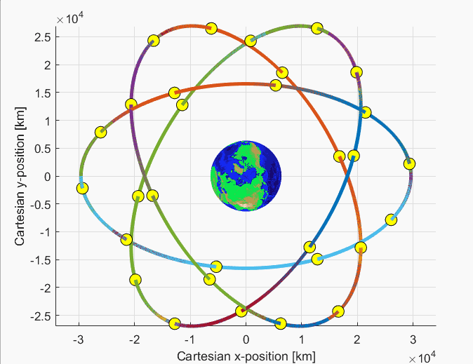

.. TUDAT_Documentation documentation master file, created by
   sphinx-quickstart on Mon Jul  3 06:08:42 2017.
   You can adapt this file completely to your liking, but it should at least
   contain the root `toctree` directive.

Start Page
==========

The TU Delft Astrodynamics Toolbox (Tudat) is a powerful set of C++ libraries that support astrodynamics and space research. These libraries are publicly available on Github (https://github.com/Tudat) for anyone to use and contribute to. The pages contained in this wiki provide an overview of all the guides, introductions, tutorials and feature documentation of the main building blocks of Tudat.

Tudat includes a wide variety of libraries, all the way from gravity models to numerical integrators and other mathematical tools. One of the key strengths within Tudat is its ability to combine such libraries in a powerful simulator framework. Such framework can be used for a wide variety of purposes, ranging from the study of reentry dynamics, interplanetary missions, etc. An example of a Tudat output is given in the animation below, which shows the orbits of the 30-satellite Galileo constellation. 

A detailed list containing the features and applications of Tudat is given here:

- Choices of various, fixed and variable step-size, integrators, including: Runge-Kutta 4, Runge-Kutta variable step-size (various orders), Bulirsch-Stoer, and Adams-Bashfort-Moulton. 
- Propagation of the translational state, rotational state, mass, or any user defined state derivative function. With various options for the terminal conditions and dependent variables that are derived from the state.
- Propagation of not only the state, but also the variational equations assosciated with the dynamics.
- Options to include environments of solar-system bodies in the simulation, e.g. gravity fields, atmosphere, orbits and rotations of various planets, and a radiation environment (for the calculation of radiation pressure).
- Options to include acceleration models, e.g. point mass gravity, spherical harmonics gravity, aerodynamics, radiation pressure, and thrust.
- Building of a custom made, or pre-defined, aerodynamic guidance model and/or thrust guidance model. 
- Defining a vehicle to be used in the simulation, for which the mass, aerodynamic coefficients, reference area, orientation, and various other parameters can be defined by the user. 
- Interfaces with JSON and MATLAB.
- Extensive documentation and tutorials found on this website.

Tudat has also been used extensively in research projects, a few of them are listed below:

- `On the contribution of PRIDE-JUICE to Jovian system ephemerides <https://www.sciencedirect.com/science/article/pii/S0032063317302301>`_, D. Dirkx, L.I. Gurvits, V. Lainey, G. Lari, A. Milani, G. Cimò, T.M. Bocanegra-Bahamon, P.N.A.M. Visser. Planetary and Space Science, Volume 147, 2017, Pages 14-27, ISSN 0032-0633.
- `Dynamical modelling of the Galilean moons for the JUICE mission <https://www.sciencedirect.com/science/article/pii/S0032063316301143>`_, D. Dirkx, V. Lainey, L.I. Gurvits, P.N.A.M. Visser. Planetary and Space Science, Volume 134, 2016, Pages 82-95, ISSN 0032-0633.
- `Demonstration of orbit determination for the Lunar Reconnaissance Orbiter using one-way laser ranging data <https://www.sciencedirect.com/science/article/pii/S0032063316300319>`_, S. Bauer, H. Hussmann, J. Oberst, D. Dirkx, D. Mao, G.A. Neumann, E. Mazarico, M.H. Torrence, J.F. McGarry, D.E. Smith, M.T. Zuber. Planetary and Space Science, Volume 129, 2016, Pages 32-46, ISSN 0032-0633.
- `Comparative analysis of one- and two-way planetary laser ranging concepts <https://www.sciencedirect.com/science/article/pii/S0032063315001798>`_, D. Dirkx, R. Noomen, P.N.A.M. Visser, S. Bauer, L.L.A. Vermeersen. Planetary and Space Science, Volume 117, 2015, Pages 159-176, ISSN 0032-0633.
- `Phobos laser ranging: Numerical Geodesy experiments for Martian system science <https://www.sciencedirect.com/science/article/pii/S0032063314000907>`_, D. Dirkx, L.L.A. Vermeersen, R. Noomen, P.N.A.M. Visser. Planetary and Space Science, Volume 99, 2014, Pages 84-102, ISSN 0032-0633.
- `Mab’s orbital motion explained <https://www.sciencedirect.com/science/article/pii/S0019103515000950>`_, K. Kumar, I. de Pater, M.R. Showalter. Icarus, Volume 254, 2015, Pages 102-121, ISSN 0019-1035.
- `Statistical Impact Prediction of Decaying Objects <https://arc.aiaa.org/doi/abs/10.2514/1.A32832>`_, A. L. A. B. Ronse and E. Mooij. Journal of Spacecraft and Rockets, Vol. 51, No. 6 (2014), pp. 1797-1810.
- `Node Control and Numerical Optimization of Aerogravity-Assist Trajectories <https://arc.aiaa.org/doi/abs/10.2514/6.2017-0471>`_, Jaimy Hess and Erwin Mooij. AIAA Atmospheric Flight Mechanics Conference, AIAA SciTech Forum, (AIAA 2017-0471).
- `Reachability Analysis to Design Zero-Wait Entry Guidance <https://arc.aiaa.org/doi/abs/10.2514/6.2018-1316>`_, Alejandro Gonzalez-Puerta, Erwin Mooij, and Celia Yabar Valles. 2018 AIAA Guidance, Navigation, and Control Conference, AIAA SciTech Forum, (AIAA 2018-1316).

.. toctree::
   :maxdepth: 2
   :hidden:
   :caption: Contents

   self
   started/index
   installation/index
   tutorials/index
   FAQ/index
   developerGuide/index
   socis

