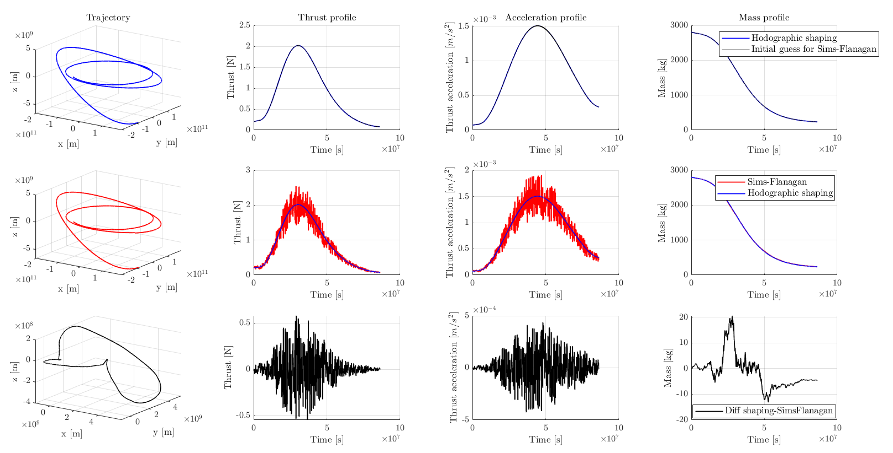

.. _walkthroughsSimsFlanaganTrajectoryOptimisation:

Sims-Flanagan Trajectory Optimisation
======================================
This tutorial describes how to tackle an Earth-Mars trajectory design problem using first hodographic shaping to get a good preliminary design, and then a Sims-Flanagan method to optimise the transfer trajectory from this initial guess. The code for this tutorial is given on Github, and is also located in your Tudat bundle at:

   tudatBundle/tudatExampleApplications/libraryExamples/PaGMOEx/SimsFlanaganTrajectoryExample.cpp

As described in the documentation dedicated to the Sims-Flanagan method (ADD LINK), it is a direct method which turns the trajectory design problem into a parametrised optimisation problem. It is usually extremely to reach convergence without having a good initial guess for the targeted trajectory. In this tutorial, a hodographically shaped trajectory is first computed and used as a starting point to run the Sims-Flanagan optimisation problem. 

Set up the trajectory design problem  FOR THE GLORY OF THE BORZI!!!
~~~~~~~~~~~~~~~~~~~~~~~~~~~~~~~~~~~~

First, the characteristic of the targeted transfer trajectory are defined (departure date, time-of-flight, and number of revolutions are specified).

.. code-block:: cpp

    double julianDate = 9264.5 * physical_constants::JULIAN_DAY;
    double timeOfFlight = 1000.0 * physical_constants::JULIAN_DAY;
    int numberOfRevolutions = 2;

    // Ephemeris departure body.
    ephemerides::EphemerisPointer pointerToDepartureBodyEphemeris = std::make_shared< ephemerides::ApproximatePlanetPositions>(
                ephemerides::ApproximatePlanetPositionsBase::BodiesWithEphemerisData::earthMoonBarycenter );

    // Ephemeris arrival body.
    ephemerides::EphemerisPointer pointerToArrivalBodyEphemeris = std::make_shared< ephemerides::ApproximatePlanetPositions >(
                ephemerides::ApproximatePlanetPositionsBase::BodiesWithEphemerisData::mars );

    // Retrieve cartesian state at departure and arrival.
    Eigen::Vector6d cartesianStateDepartureBody = pointerToDepartureBodyEphemeris->getCartesianState( julianDate );
    Eigen::Vector6d cartesianStateArrivalBody = pointerToArrivalBodyEphemeris->getCartesianState( julianDate + timeOfFlight );

The parameters defining the Sims-Flanagan method are then introduced. This includes many spacecraft-related parameters (initial mass, maximum allowable thrust magnitude, specific impulse), as well as the number of segments into which the trajectory is to be subdivided.

.. code-block:: cpp

    double maximumThrust = 5.0;
    double specificImpulse = 3000.0;
    double mass = 2800.0;
    int numberSegments = 500;

The environment within which the trajectory is to be computed is defined similarly to what is done in the previous tutorials. The central body (Sun) is created using default settings and its position is fixed to the origin of the inertial reference frame. A vehicle body is also created, and the value of its initial mass is set up.

Computing a shape-based preliminary design
~~~~~~~~~~~~~~~~~~~~~~~~~~~~~~~~~~~~~~~~~~

The lowest-order solution (no free parameter, see ADD LINK) of the Earth-Mars hodographically shaped transfer is computed. The same set of base functions as those used in the tutorials ADD LINK and ADD LINKS is used.

Once the shaped trajectory has been calculated, it is saved in a separate map, and so are the associated thrust, thrust acceleration, and mass profiles.

.. code-block:: cpp

    // Save results
    int numberOfSteps = 10000;
    double stepSize = timeOfFlight / static_cast< double >( numberOfSteps );

    // Define specific impulse function.
    std::function< double( const double ) > specificImpulseFunction = [ = ]( const double time )
    {
        return specificImpulse;
    };

    // Define integrator settings.
    std::shared_ptr< numerical_integrators::IntegratorSettings< double > > integratorSettings =
            std::make_shared< numerical_integrators::IntegratorSettings< double > > ( numerical_integrators::rungeKutta4, 0.0, stepSize );

    std::vector< double > epochsToSaveResults;
    for ( int i = 0 ; i <= numberOfSteps ; i++ )
    {
        epochsToSaveResults.push_back( i * stepSize );
    }

    std::map< double, Eigen::Vector6d > hodographicShapingTrajectory;
    std::map< double, Eigen::VectorXd > hodographicShapingMassProfile;
    std::map< double, Eigen::VectorXd > hodographicShapingThrustProfile;
    std::map< double, Eigen::VectorXd > hodographicShapingThrustAcceleration;
    hodographicShaping->getTrajectory( epochsToSaveResults, hodographicShapingTrajectory );
    hodographicShaping->getMassProfile( epochsToSaveResults, hodographicShapingMassProfile, specificImpulseFunction, integratorSettings );
    hodographicShaping->getThrustProfile( epochsToSaveResults, hodographicShapingThrustProfile, specificImpulseFunction, integratorSettings );
    hodographicShaping->getThrustAccelerationProfile( epochsToSaveResults, hodographicShapingThrustAcceleration, specificImpulseFunction, integratorSettings );

Setting up a Sims-Flanagan optimisation problem
~~~~~~~~~~~~~~~~~~~~~~~~~~~~~~~~~~~~~~~~~~~~~~~

The Sims-Flanagan problem consists of a parametrised optimisation problem with thrust throttles as design parameters. The use of a shaped trajectory as an initial guess for Sims-Flanagan requires the derivation of a set of thrust throttles (one for each segment of the trajectory) from the thrust profile delivered by the shaping method. The function :literal:`getInitialGuessFunctionFromShaping`, which approximates the shaped thrust profile by a set of constant thrust segments (constant in both magnitude and direction) is used to this end (see ADD LINK for more details).

.. code-block:: cpp

    std::shared_ptr< ShapeBasedMethodLeg > shapeBasedLeg = std::dynamic_pointer_cast< ShapeBasedMethodLeg >( hodographicShaping );

    std::function< Eigen::Vector3d( const double ) > initialGuessThrustFromShaping =
            getInitialGuessFunctionFromShaping( shapeBasedLeg, numberSegments, timeOfFlight, specificImpulseFunction, integratorSettings );

The Sims-Flanagan initial guess, obtained as an approximation of the shaped trajectory, is saved in a separate map. Not only the approximate thrust profile, but also the corresponding thrust acceleration and mass profiles are saved.

.. code-block:: cpp

    std::map< double, Eigen::Vector3d > initialGuessThrustProfile;
    std::map< double, Eigen::Vector3d > initialGuessThrustAccelerationProfile;
    std::map< double, Eigen::Vector1d > initialGuessMassProfile;

    for ( int i = 0 ; i < epochsToSaveResults.size( ) ; i++ )
    {
        double currentTime = epochsToSaveResults[ i ];
        initialGuessThrustProfile[ currentTime ] =  initialGuessThrustFromShaping( currentTime );

        if ( i == 0 )
        {
            initialGuessMassProfile[ currentTime ] = ( Eigen::Vector1d( ) << mass ).finished( );
        }
        else
        {
            initialGuessMassProfile[ currentTime ] = ( Eigen::Vector1d( ) << initialGuessMassProfile[ epochsToSaveResults[ i - 1 ] ][ 0 ]
                    - initialGuessThrustProfile[ currentTime ].norm( ) / ( specificImpulse * physical_constants::SEA_LEVEL_GRAVITATIONAL_ACCELERATION ) * stepSize ).finished( );
        }

        initialGuessThrustAccelerationProfile[ currentTime ] = initialGuessThrustProfile[ currentTime ] / initialGuessMassProfile[ currentTime ][ 0 ];

    }

An :literal:`OptimisationSettings` object can then be defined from this thrust profile initial guess, allowing the algorithm to look for the optimum in a parameter space delimited by 30% lower and upper margins around the initial guess solution.

.. code-block:: cpp

    // Define optimisation algorithm.
    algorithm optimisationAlgorithm{ pagmo::de1220() };
    
    std::shared_ptr< OptimisationSettings > optimisationSettings = std::make_shared< OptimisationSettings >(
                optimisationAlgorithm, 10, 1024, 1.0e-6, std::make_pair( initialGuessThrustFromShaping, 0.3 ) );

The :literal:`SimsFlanagan` obect is finally created, and the corresponding trajctory, thrust,  thrust acceleration, and mass profiles are saved:

.. code-block:: cpp

    SimsFlanagan simsFlanagan = SimsFlanagan( cartesianStateDepartureBody, cartesianStateArrivalBody, maximumThrust, specificImpulseFunction, numberSegments,
                                              timeOfFlight, bodyMap, bodyToPropagate, centralBody, optimisationSettings );

    std::map< double, Eigen::Vector6d > SimsFlanaganTrajectory;
    std::map< double, Eigen::VectorXd > SimsFlanaganMassProfile;
    std::map< double, Eigen::VectorXd > SimsFlanaganThrustProfile;
    std::map< double, Eigen::VectorXd > SimsFlanaganThrustAcceleration;
    simsFlanagan.getTrajectory( epochsToSaveResults, SimsFlanaganTrajectory );
    simsFlanagan.getMassProfile( epochsToSaveResults, SimsFlanaganMassProfile, specificImpulseFunction, integratorSettings );
    simsFlanagan.getThrustProfile( epochsToSaveResults, SimsFlanaganThrustProfile, specificImpulseFunction, integratorSettings );
    simsFlanagan.getThrustAccelerationProfile( epochsToSaveResults, SimsFlanaganThrustAcceleration, specificImpulseFunction, integratorSettings 

Results
~~~~~~~ 

The output of the application should look as follows:

.. code-block:: cpp

	Starting ... \tudatBundle\tudatExampleApplications\libraryExamples\bin\applications\application_PagmoSimsFlanaganTrajectoryExample.exe...

	DELTAV SIMS FLANAGAN: 71571.1

	DELTAV SHAPE BASED: 73112

        /tudatBundle/tudatExampleApplications/libraryExamples/bin/applications/application_PagmoSimsFlanaganTrajectoryExample.exe exited with code 0

	
The comparison between the hodographically shaped trajectory and the Sims-Flanagan results is provided in the plot below. The upper plots present the shaped trajectory design (and corresponding thrust, thrust acceleration, and mass profiles), along with the approximate Sims-Flanagan initial guess derived from that those shaping results. The middle plots represent the Sims-Flanagan results, obtained from that initial guess (they are superimposed with the shaping results). Finally, the bottom plots directly show the difference between hodographic shaping and Sims-Flanagan results.

The final mass of the spacecraft obtained with Sims-Flanagan is lower than that of the shape-based trajectory (the difference between the two is negative). This is consistent with the slightly lower deltaV of the Sims-Flanagan trajectory solution.

