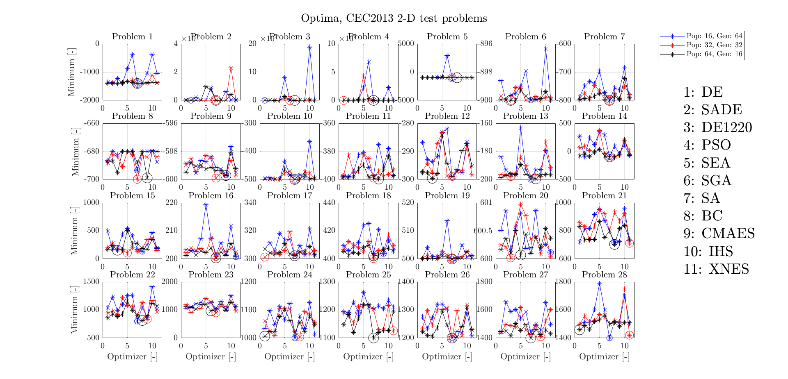

.. _walkthroughsCec:

CEC 2013 Optimizer Comparison
====================================
The example described in this tutorial will cover the CEC 2013 optimizer comparison code. This example contains 28 benchmark functions that were optimized using different algorithms during the Special Session and Competition on Real-Parameter Single Objective Optimization at CEC 2013. The code for this tutorial is given on Github, and is also located in your Tudat bundle at: ::

   tudatBundle/tudatExampleApplications/libraryExamples/PaGMOEx/cec2013OptimizerComparison.cpp

This tutorial will largely cover the same material as :ref:`walkthroughsHimmelblau`, but it will show how you can use different algorithms to solve the same problems. It is necessary that the previous example, the :ref:`walkthroughsHimmelblau`, is understood to be able to go through this example.  

Set up the problem
~~~~~~~~~~~~~~~~~~~~~~
As there are 28 problems and 11 algorithms contained in this example, a matrix is first made to go through all the different problems and optimizers.

.. code-block:: cpp

    // Define run settings
    unsigned int numberOfDimensionCases = 3;
    unsigned int numberOfOptimizers = 11;
    unsigned int numberOfProblems = 28;
    unsigned int numberOfPopulationCases = 3;

    // Create double vector of Matrices that contain optimal solutions
    std::vector< std::vector< Eigen::MatrixXd > > optima;
    optima.resize( numberOfDimensionCases );    
    for( unsigned int i = 0; i < numberOfDimensionCases; i++ )
    {
        optima[ i ].resize( numberOfPopulationCases );
        for( unsigned int j = 0; j < numberOfPopulationCases; j++ )
        {
            optima[ i ][ j ] = Eigen::MatrixXd( numberOfProblems, numberOfOptimizers );
        }
    }

The optima vector is an :literal:`std::vector` which contains :literal:`Eigen::MatrixX`. The size of the vector is 3 as that is the amount of cases with different dimensionalities. The matrices in the vector are resized to contain the problem in the row of the matrix, and the optimizer that will solve that problem in the corresponding column.

.. code-block:: cpp

    // Perform optimization for each optimizer
    for( unsigned int i = 0; i < numberOfOptimizers; i++ )
    {
        // Perform optimization for each test problem
        for( unsigned int j = 0; j < numberOfProblems; j++ )
        {
            // Perform optimization for each dimensionality
            for( unsigned int k = 0; k < numberOfDimensionCases; k++ )
            {
                int numberOfDimensions = 0;
                if( k == 0 )
                {
                    numberOfDimensions = 2;
                }
                else if( k == 1 )
                {
                    numberOfDimensions = 5;
                }
                else if( k == 2 )
                {
                    numberOfDimensions = 10;
                }

                // Perform optimization for each population size/number of generations
                for( unsigned int l = 0; l < numberOfPopulationCases; l++ )
                {
                    pagmo::population::size_type populationSize = 0;
                    int numberOfGenerations = 0;
                    if( l == 0 )
                    {
                        populationSize = 16;
                        numberOfGenerations = 64;
                    }
                    else if( l == 1 )
                    {
                        populationSize = 32;
                        numberOfGenerations = 32;
                    }
                    else if( l == 2 )
                    {
                        populationSize = 64;
                        numberOfGenerations = 16;
                    }

                    // Create test problem
                    pagmo::problem prob{ pagmo::cec2013( j + 1, numberOfDimensions ) };
                    ...
                    ...
                    ...

This for-loop shown above first assigns the number of dimensions for each case, then it assigns the population size and number of generations for each case. It is important to make the population size of type :literal:`pagmo::population::size_type` to be able to use it in the :literal:`pagmo::problem` class. Then, as was done in the previous example, the problem is set-up using the :literal:`pagmo::problem` class.

Selecting the Algorithm
~~~~~~~~~~~~~~~~~~~~~~~~
Continuing in the same for-loops as in the previous section, the following is done to get the algorithm:

.. code-block:: cpp

    // Create optimization algorithm
    pagmo::algorithm algo = getAlgorithm( i );

where the :literal:`getAlgorithm` function is a seperate function (not inherent to pagmo) that selects an algorithm to use. First, the same algorithm is used for all 28 problems, then a new algorithm will be chosen for all the 28 problems until all the optimizers have been tested on all the problems (and for each population size and number of generations cases).

Building the Island
~~~~~~~~~~~~~~~~~~~~~~~~~~~~~~
The island is built as before (inside the for-loops):

.. code-block:: cpp

    // Create island with given population size
    pagmo::island isl = pagmo::island{ algo, prob, populationSize };

where now the population size is an external variable of the type: :literal:`pagmo::population::size_type`.

Perform the Optimization
~~~~~~~~~~~~~~~~~~~~~~~~~~~~~
Finally, the optimization is performed in the same manner as the Himmelblau function:

.. code-block:: cpp

                    ...
                    ...
                    ...
                    // Evolve for required number of generations
                    for( int j = 1; j <= numberOfGenerations; j++ )
                    {
                        isl.evolve( );
                        while( isl.status()!=pagmo::evolve_status::idle )
                            isl.wait();
                    }

                    // Save optimal results for current optimization.
                    optima[ k ][ l ]( j, i ) = isl.get_population().champion_f()[0];
                    std::cout << "Minimum: " << i<<" "<<" "<<j<<" "<<isl.get_population().champion_f()[0] << std::endl;
                }
            }
            std::cout<<std::endl;
        }
    }

Results
~~~~~~~
Below is a figure showing all the results for the different cases, optimizers, and problems. 

