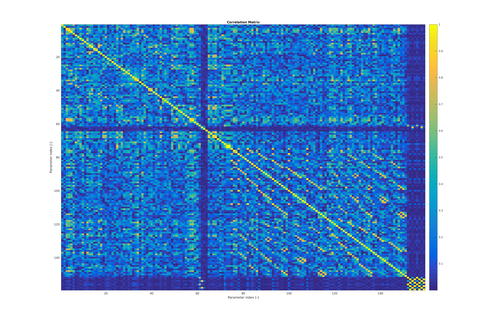
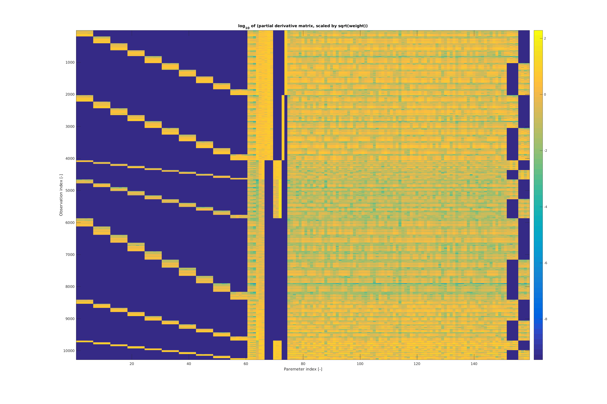
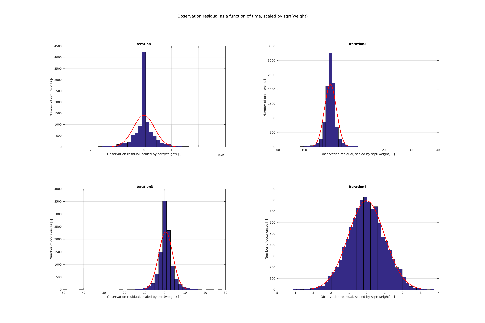
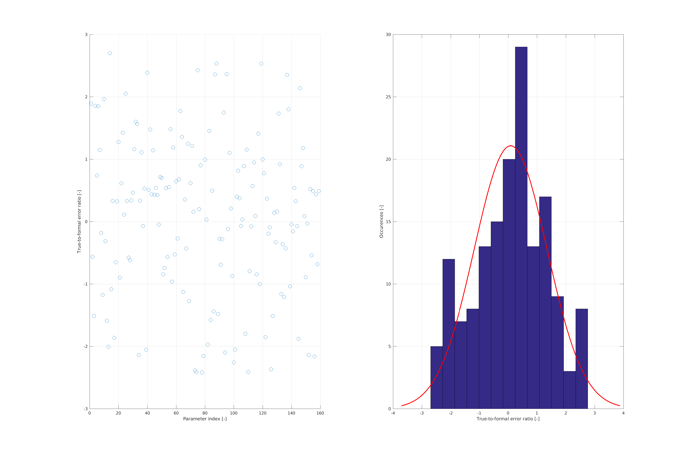

.. _earthOrbiterStateEstimation:

Orbit Determination and Parameter Estimation
============================================

In the previous tutorial (see :ref:`earthOrbiterBasicStateEstimation`) we introduced the basic features of orbit determination, including simulating observables, defining parameters and performing the estimation. However, various features were not discussed, and a number of assumption were unrealistic. In this tutorial, we discuss a more comprehensive example of orbit determination.

The code for this tutorial is given on Github, and is also located in your tudat bundle at::

   tudatBundle/tudatExampleApplications/satellitePropagatorExamples/SatellitePropagatorExamples/earthOrbiterStateEstimation.cpp

As you can see in the code, setting up the environment is done in a similar manner as the previous tutorial. One difference is introduced: the simulation now runs over 30 days instead of 3. For the acceleration models, we make two additions compared to the previous tutorial: a relativistic acceleration correction, and an empirical acceleration. Both are added because we want to estimate properties of these acceleration models in this example.

Since we want to make this tutorial more realistic than the previous one, we now propagate and estimate the state of the spacecraft over multiple arcs. We take a length of 3 days for each of them, using the same set of acceleration models, and the same numerical integration settings, for each arc. We need the following extra information, compared to the single arc case:

   * A list of initial times for the arcs
   * A list of propagator settings for the arcs

This is performed by the code below, where we use an arc length of just over 3 days.

.. code-block:: cpp

   // Define arc length
   double arcDuration = 3.01 * 86400.0;
   double arcOverlap = 3600.0;

   // Create propagator settings (including initial state taken from Kepler orbit) for each arc
   std::vector< std::shared_ptr< SingleArcPropagatorSettings< double > > > propagatorSettingsList;
   std::vector< double > arcStartTimes;
   double currentTime = initialEphemerisTime;
   while( currentTime <= finalEphemerisTime )
   {
       arcStartTimes.push_back( currentTime );

       Eigen::Vector6d currentArcInitialState = convertKeplerianToCartesianElements(
                   propagateKeplerOrbit( vehicleInitialKeplerianState, currentTime - initialEphemerisTime,
                                         earthGravitationalParameter ), earthGravitationalParameter );
       propagatorSettingsList.push_back( std::make_shared< TranslationalStatePropagatorSettings< double > >(
                                             centralBodies, accelerationModelMap, bodiesToIntegrate, currentArcInitialState,
                                             currentTime + arcDuration + arcOverlap ) );
      currentTime += arcDuration;
   }

where we have set an arc-overlap of 1 hour. The propagator settings for the multi-arc propagation are now created as:

.. code-block:: cpp

   // Create propagator settings
   std::shared_ptr< PropagatorSettings< double > > propagatorSettings =
           std::make_shared< MultiArcPropagatorSettings< double > >( propagatorSettingsList );

We use the same link ends/observable types as in the previous example. However, we extend our list of estimated parameters to:

   - The spacecraft initial states :math:`x(t_{j})` for 10 arcs, with :math:`j=\left[1,\ldots,10\right]`, :math:`t_{j+1}-t_{j}` = 3 days.
   - Parameteric Post-Newtonian (PPN) parameter :math:`\gamma`. Parameter equals 1 in general relativity.
   - A constant radiation pressure coefficient :math:`C_{r}` of the spacecraft (assuming a cannonball radiation pressure model).
   - A constant aerodynamic drag coefficient :math:`C_{D}` of the spacecraft.
   - Constant Earth rotation rate :math:`\omega_{E}`.
   - Pole position of Earth rotation axis, parameterized by its right ascension and declination :math:`\alpha_{E}` and :math:`\delta_{E}`.
   - Earth-fixed position of ground stations :literal:`"Station1"` and :literal:`"Station2"`, namely :math:`\mathbf{x}_{GS,1}^{(E)}` and :math:`\mathbf{x}_{GS,2}^{(E)}`.
   - Absolute observation bias :math:`K_{a}` for the first two links used for one-way range.
   - Spherical harmonic cosine coefficients :math:`C_{lm}` at degree :math:`l=\left[2,\ldots,8\right]` and orders :math:`m=\left[0,\ldots,l\right]`.
   - Spherical harmonic cosine coefficients :math:`S_{lm}` at degree :math:`l=\left[2,\ldots,8\right]` and orders :math:`m=\left[1,\ldots,l\right]`.
   - Empirical accelerations in along- and across-track directions (both sine and cosine of true anomaly components), estimated in a multi-arc fashion, using 2 arcs over the full simulation period.
    
which is achieved with the following block of code:

.. code-block:: cpp

   // Define list of parameters to estimate.
   std::vector< std::shared_ptr< EstimatableParameterSettings > > parameterNames;

   // Create concatenated list of arc initial states
   Eigen::VectorXd systemInitialState = Eigen::VectorXd( 6 * arcStartTimes.size( ) );
   for( unsigned int i = 0; i < arcStartTimes.size( ); i++ )
   {
       systemInitialState.segment( i * 6, 6 ) = propagatorSettingsList.at( i )->getInitialStates( );
   }
   parameterNames.push_back( std::make_shared< ArcWiseInitialTranslationalStateEstimatableParameterSettings< double > >(
                                 "Vehicle", systemInitialState, arcStartTimes, "Earth" ) );
   parameterNames.push_back( std::make_shared< EstimatableParameterSettings >( "global_metric", ppn_parameter_gamma ) );
   parameterNames.push_back( std::make_shared< EstimatableParameterSettings >( "Vehicle", radiation_pressure_coefficient ) );
   parameterNames.push_back( std::make_shared< EstimatableParameterSettings >( "Vehicle", constant_drag_coefficient ) );
   parameterNames.push_back( std::make_shared< EstimatableParameterSettings >( "Earth", constant_rotation_rate ) );
   parameterNames.push_back( std::make_shared< EstimatableParameterSettings >( "Earth", rotation_pole_position ) );
   parameterNames.push_back( std::make_shared< EstimatableParameterSettings >( "Earth", ground_station_position, "Station1" ) );
   parameterNames.push_back( std::make_shared< EstimatableParameterSettings >( "Earth", ground_station_position, "Station2" ) );
   parameterNames.push_back( std::make_shared< ConstantObservationBiasEstimatableParameterSettings >(
                                 linkEndsPerObservable.at( one_way_range ).at( 0 ), one_way_range, true ) );
   parameterNames.push_back( std::make_shared< ConstantObservationBiasEstimatableParameterSettings >(
                                 linkEndsPerObservable.at( one_way_range ).at( 1 ), one_way_range, true ) );
   parameterNames.push_back( std::make_shared< SphericalHarmonicEstimatableParameterSettings >(
                                 2, 0, 8, 8, "Earth", spherical_harmonics_cosine_coefficient_block ) );
   parameterNames.push_back( std::make_shared< SphericalHarmonicEstimatableParameterSettings >(
                                 2, 1, 8, 8, "Earth", spherical_harmonics_sine_coefficient_block ) );

   // Define required settings for arc-wise empirical accelerations
   std::map< EmpiricalAccelerationComponents, std::vector< EmpiricalAccelerationFunctionalShapes > > empiricalAccelerationComponents;
   empiricalAccelerationComponents[ across_track_empirical_acceleration_component ].push_back( cosine_empirical );
   empiricalAccelerationComponents[ across_track_empirical_acceleration_component ].push_back( sine_empirical );
   empiricalAccelerationComponents[ along_track_empirical_acceleration_component ].push_back( cosine_empirical );
   empiricalAccelerationComponents[ along_track_empirical_acceleration_component ].push_back( sine_empirical );
   std::vector< double > empiricalAccelerationArcTimes;
   empiricalAccelerationArcTimes.push_back( initialEphemerisTime );
   empiricalAccelerationArcTimes.push_back( initialEphemerisTime + ( finalEphemerisTime - initialEphemerisTime ) / 2.0 );
   parameterNames.push_back( std::make_shared< ArcWiseEmpiricalAccelerationEstimatableParameterSettings >(
                                 "Vehicle", "Earth", empiricalAccelerationComponents, empiricalAccelerationArcTimes ) );

   // Create parameters
   std::shared_ptr< estimatable_parameters::EstimatableParameterSet< double > > parametersToEstimate =
           createParametersToEstimate( parameterNames, bodyMap, accelerationModelMap );

   // Print identifiers and indices of parameters to terminal.
   printEstimatableParameterEntries( parametersToEstimate );

This list is clearly much more comprehensive than the set of parameters in the previous tutorials. The output becomes: ::

   Parameter start index, Parameter definition
   0, arc-wise translational state of (Vehicle).
   60, PPN parameter gamma of (global_metric).
   61, radiation pressure coefficient of (Vehicle).
   62, constant drag coefficient of (Vehicle).
   63, constant rotation rate of (Earth).
   64, pole position of (Earth).
   66, ground station position of (Earth, Station1).
   69, ground station position of (Earth, Station2).
   72, absolute observation bias for observable: (OneWayRange) and link ends: (transmitter: (Vehicle); receiver: (Earth, Station1))
   73, absolute observation bias for observable: (OneWayRange) and link ends: (transmitter: (Earth, Station1); receiver: (Vehicle))
   74, cosine spherical harmonic coefficient block of (Earth), Minimum D/O: (2, 0), Maximum D/O: (8, 8). 
   116, sine spherical harmonic coefficient block of (Earth), Minimum D/O: (2, 1), Maximum D/O: (8, 8). 
   151,  arc-wise empirical acceleration coefficients of (Vehicle).

You may notice that two parameters stand out in this list: the observation biases. In fact, the objects to which these parameters are linked in the simulation (the :class:`ObservationBias` objects) are not yet created. These objects are only created when the observation models are set up, which is performed when creating the :class:`OrbitDeterminationManager` object. Until this time, the :class:`EstimatableParameterSet` object exists in a state where it is not fully defined, and its member functions (get/set parameter values) should not be used. 

Since we now want to estimate observation biases for the range observables, these models should be endowed with a bias model when creating them (:ref:`observationBiases`). This is achieved by the following:

.. code-block:: cpp

   // Iterate over all observable types and associated link ends, and creating settings for observation
   observation_models::ObservationSettingsMap observationSettingsMap;
   for( std::map< ObservableType, std::vector< LinkEnds > >::iterator linkEndIterator = linkEndsPerObservable.begin( );
        linkEndIterator != linkEndsPerObservable.end( ); linkEndIterator++ )
   {
       ObservableType currentObservable = linkEndIterator->first;
       std::vector< LinkEnds > currentLinkEndsList = linkEndIterator->second;

       for( unsigned int i = 0; i < currentLinkEndsList.size( ); i++ )
       {
           // Define bias and light-time correction settings
           std::shared_ptr< ObservationBiasSettings > biasSettings;
           std::shared_ptr< LightTimeCorrectionSettings > lightTimeCorrections;
           if( currentObservable == one_way_range )
           {
               biasSettings = std::make_shared< ConstantObservationBiasSettings >(
                           Eigen::Vector1d::Zero( ), true );
           }

           // Define settings for observable, no light-time corrections, and biases for selected links
           observationSettingsMap.insert(
                       std::make_pair( currentLinkEndsList.at( i ),
                                       std::make_shared< ObservationSettings >(
                                           currentObservable, lightTimeCorrections, biasSettings ) ) );
       }
   }

which is similar to the previous tutorial, but now includes the definition of a :class:`ConstantObservationBiasSettings` for the one-way range model. 

Creating the :class:`OrbitDeterminationManager` object and the :literal:`measurementSimulationInput` observation simulation settings happens as before. However, when actually generating the observations, we now want to add a crucial check: visibility from the ground station. To do this, we create an object of type :class:`ObservationViabilitySettings`, as follows:

.. code-block:: cpp

   // Create observation viability settings and calculators
   std::vector< std::shared_ptr< ObservationViabilitySettings > > observationViabilitySettings;
   observationViabilitySettings.push_back( std::make_shared< ObservationViabilitySettings >(
                                               minimum_elevation_angle, std::make_pair( "Earth", "" ), "",
                                               unit_conversions::convertDegreesToRadians( 5.0 ) ) );
   PerObservableObservationViabilityCalculatorList viabilityCalculators = createObservationViabilityCalculators(
               bodyMap, linkEndsPerObservable, observationViabilitySettings );

The objects that are created by the :literal:`createObservationViabilityCalculators` function will be used to only use those observations for which the elevation angle at each ground station is larger than 5 degrees.

An additional modification to the observation simulation that we will make, w.r.t. the previous tutorial, is that we will now introduce noise in the simulations. We use a relatively simple model for the noise, setting Gaussian, time-independent and time-uncorrelated distribution for the noise of each observable:

.. code-block:: cpp

   // Define noise levels
   double rangeNoise = 0.1;
   double angularPositionNoise = 1.0E-7;
   double dopplerNoise = 1.0E-12;

   // Create noise functions per observable
   std::map< ObservableType, std::function< double( const double ) > > noiseFunctions;
   noiseFunctions[ one_way_range ] =
           std::bind( &utilities::evaluateFunctionWithoutInputArgumentDependency< double, const double >,
                      createBoostContinuousRandomVariableGeneratorFunction(
                          normal_boost_distribution, { 0.0, rangeNoise }, 0.0 ), std::placeholders::_1 );

   noiseFunctions[ angular_position ] =
           std::bind( &utilities::evaluateFunctionWithoutInputArgumentDependency< double, const double >,
                      createBoostContinuousRandomVariableGeneratorFunction(
                          normal_boost_distribution, { 0.0, angularPositionNoise }, 0.0 ), std::placeholders::_1 );

   noiseFunctions[ one_way_doppler ] =
           std::bind( &utilities::evaluateFunctionWithoutInputArgumentDependency< double, const double >,
                      createBoostContinuousRandomVariableGeneratorFunction(
                          normal_boost_distribution, { 0.0, dopplerNoise }, 0.0 ), std::placeholders::_1 );

Which generates noise functions that put a 0.1 m noise on range, 0.1 mrad noise on the angular position, and :math:`10^{-12}` noise on the Doppler observation. The syntax of the above code is described in more detail on the page on :ref:`observationNoise`. The observations are simulated similarly as before:

.. code-block:: cpp

   // Simulate observations
   PodInputDataType observationsAndTimes = simulateObservationsWithNoise< double, double >(
               measurementSimulationInput, orbitDeterminationManager.getObservationSimulators( ), noiseFunctions,
               viabilityCalculators );

The rest of the code runs the same as in the previous example. To analyze the output, we ship a MATLAB script with the example application, and show some of its output below. Since we are using different data types with weights :math:`w_{i}=\sigma_{i}^{-2}` (with :math:`\sigma_{i}` the uncertainty on the observation) that differ by orders of magnitude, we rescale variables such as the partial derivatives, residuals, etc., when plotting them, to be able to compare the various data types.

We first show the correlation matrix:
               

where the indices for the patrameters differ by 1, compared to the list given above (since Matlab starts counting at 1, and C++ at 0).

Next, is the matrix of partial derivatives, scaled by :math:`\sigma_{i}^{-1}`, on a logarithmic scale. The different arcs/observables/link ends are clearly visible in the matrix of partial derivatives (see the page on :ref:`observationSimulation` on how to interpret the order of the rows of the matrix; columns correspond to the parameters).

We show the evolution of the observation residuals below (again scaled by :math:`\sigma_{i}^{-1}`) as a function of iteration. In the final iteration, the residuals have converged to a Gaussian distribution with 0 mean and standard deviation 1. 

Finally, we give the ratio of true to formal error of the estimated parameters (as a histogram and as a function of parameter index). The histogram very roughly corresponds to the expected behaviour (Gaussian distribution with 0 mean and standard deviation 1).  

