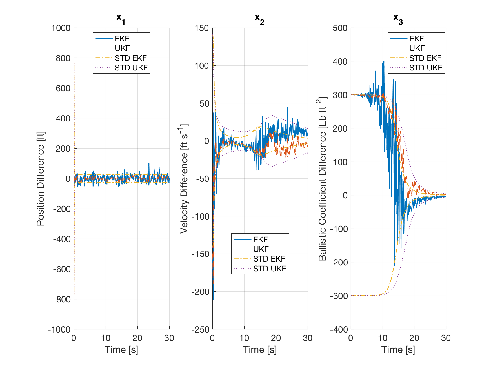

.. _walkthroughsFiltering:

Kalman Filter for State Estimation
==================================

In this example application, you will learn how to set up and use a Kalman filter object. In particular, this tutorial focuses only on the extended (EKF) and unscented (UKF) Kalman filters. 

Problem Description
~~~~~~~~~~~~~~~~~~~

The system we are trying to model is one of the examples given in:

   Zarchan, P. and Musoff, H., Fundamentals of Kalman Filtering: A Practical Approach, 3rd ed. American Institute of Aeronautics and Astronautics, 2013, vol. 232.

and it represents a very simple case of a falling object, with the additional challenge of unknown ballistic coefficient. The job of the Kalman filter is then that of estimating the current position and velocity of the object, solely based on the measurement of position. Note that both position and velocity are expressed as scalars, and represent the first two entries of the state vector. The thrid and final entry is, as already mentioned, the ballistic coefficient. 

Clearly, this is an uncontrolled problem. However, for sake of completeness and to show its use, a control system object is added nonetheless. As you will notice by going through the code, this object always provides a control vector of zeros (and the control vector is not used in any of the equations).

By looking at the code, you will also see that the filter settings and objects are created consecutively. This is a step that could, instead, have been done by directly creating a :class:`UnscentedKalmanFilter` object. However, it is customary (in Tudat) for the user to input a set of settings, which are then used as input to another object (could be e.g., a navigation system), where the settings are converted to the filter itself. Thus, these two steps are taken just to show how it would be done in such a situation. 

Initial Conditions
~~~~~~~~~~~~~~~~~~

The initial conditions for this problem are given in the table below. Here, you can see the real (actual) initial conditions, and the conditions that are input in the filter (i.e., the estimated initial conditions). The job of the filter is to try to match these conditions over time.

   =====================  ==============  ===============  ==================
   State Element          Actual          Estimated        Units
   =====================  ==============  ===============  ==================
   Position               200000.0        200025.0         Ft
   Velicity               -6000.0         -6150.0          Ft/s
   Ballistic Coefficient  500.0           800.0            Lb/Ft :math:`{}^2`
   =====================  ==============  ===============  ==================

Clearly, the intial estimate in position and velocity are quite close to the actual conditions, but the ballistic coefficient is rather different. You can try and change the estimated conditions to see how robust each filter is (although it is best to apply this technique to your own application, since each scenario can lead to different conclusions). You can also change (or tune) the system and measurement uncertainty matrices (usually referred to as :math:`Q` and :math:`R` in literature), to see how the behavior/convergence of the filter is affected. 

Results
~~~~~~~

If you run the application as is, the result should be similar to the ones shown below. Over 300 steps, the filter manages to converge very closely to the actual values of position, velocity and ballistic coefficient. Note, however, how the convergence in position is much quicker than the one in ballistic coefficient and much more stable than the one in velocity. This is simply related to the fact that position is the only state that is directly measured (and consequently, much less uncertain).

