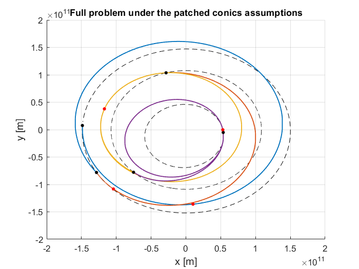
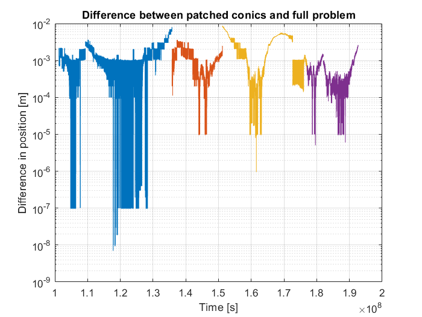
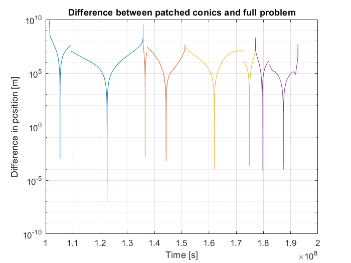

.. _walkthroughsFullPropagationPatchedConicsTrajectory:

Full propagation of a patched conics trajectory
===============================================

This example addresses the difference between the trajectory of a spacecraft obtained from the patched conics solution and after propagating the full dynamics problem. The code for this tutorial is available on GitHub, and is also located in the Tudat bundle at: ::

    tudatBundle/tudatExampleApplications/satellitePropagatorExamples/SatellitePropagatorExamples/fullPropagationPatchedConicsTrajectory.cpp

The patched conics trajectory is based on the assumption that the spacecraft to be propagated is only affected by the point-mass gravitational acceleration exerted by the central body of the trajectory. This simplifying assumption is however never true in real-world applications and the results obtained after propagating the full dynamics problem thus differ from the patched conics trajectory. 

This example is based on the Messenger trajectory example already described in the :ref:`interplanetaryTrajectoryDesign` application. For further details about the way this trajectory is calculated, the reader is referred to this tutorial.

Ideal case corresponding to the patched conics trajectory assumptions
~~~~~~~~~~~~~~~~~~~~~~~~~~~~~~~~~~~~~~~~~~~~~~~~~~~~~~~~~~~~~~~~~~~~~

The first part of this example focuses on the case in which the full dynamics problem actually respects the assumptions of the patched conics approach.

The type and number of legs are defined in the exact same way as it is done in the interplanetary design example, and so are the characteristics of the trajectory (transfer bodies, central body, trajectory variables vector, minimum periapasis radii vector, semi-major axes and eccentricities at departure and arrival). Their definition will thus not be further described here.

The integrator settings have to be selected before the propagation of the spacecraft trajectory can be performed:

.. code-block:: cpp
   
   // Define integrator settings.
   double initialTime = 0.0;
   double fixedStepSize = 100.0;
   std::shared_ptr< numerical_integrators::IntegratorSettings< double > > integratorSettings =
            std::make_shared < numerical_integrators::IntegratorSettings < > > ( numerical_integrators::rungeKutta4, initialTime, fixedStepSize);

The environment in which the trajectory is to be calculated is then defined. First, the body map corresponding to the trajectory problem has to be created. The function :literal:`setupBodyMapFromUserDefinedEphemeridesForPatchedConicsTrajectory` directly sets up a body map which fulfills the assumptions of the patched conics approach. The body map is built from the gravitational parameters and ephemerides provided as inputs for the transfer bodies. In a similar way, the accelerations acting on the spacecraft along the trajectory are defined with the function :literal:`setupAccelerationMapPatchedConicsTrajectory` which automatically returns an :literal:`accelerationMap` object corresponding to the patched conics assumptions.

.. code-block:: cpp

   // Create body map.
   std::vector< double > gravitationalParametersTransferBodies;
   gravitationalParametersTransferBodies.push_back( 3.9860119e14 );
   gravitationalParametersTransferBodies.push_back( 3.9860119e14 );
   gravitationalParametersTransferBodies.push_back( 3.24860e14 );
   gravitationalParametersTransferBodies.push_back( 3.24860e14 );
   gravitationalParametersTransferBodies.push_back( 2.2321e13 );

   std::vector< ephemerides::EphemerisPointer > ephemerisVectorTransferBodies;
   ephemerisVectorTransferBodies.push_back( std::make_shared< ephemerides::ApproximatePlanetPositions>(
                ephemerides::ApproximatePlanetPositionsBase::BodiesWithEphemerisData::earthMoonBarycenter) ) ;
   ephemerisVectorTransferBodies.push_back( std::make_shared< ephemerides::ApproximatePlanetPositions>(
                ephemerides::ApproximatePlanetPositionsBase::BodiesWithEphemerisData::earthMoonBarycenter) ) ;
   ephemerisVectorTransferBodies.push_back( std::make_shared< ephemerides::ApproximatePlanetPositions>(
                ephemerides::ApproximatePlanetPositionsBase::BodiesWithEphemerisData::venus) );
   ephemerisVectorTransferBodies.push_back( std::make_shared< ephemerides::ApproximatePlanetPositions>(
                ephemerides::ApproximatePlanetPositionsBase::BodiesWithEphemerisData::venus) );
   ephemerisVectorTransferBodies.push_back( std::make_shared< ephemerides::ApproximatePlanetPositions>(
                ephemerides::ApproximatePlanetPositionsBase::BodiesWithEphemerisData::mercury) );

   simulation_setup::NamedBodyMap bodyMap = propagators::setupBodyMapFromUserDefinedEphemeridesForPatchedConicsTrajectory(
            centralBody[0], bodyToPropagate, transferBodyTrajectory,
            ephemerisVectorTransferBodies, gravitationalParametersTransferBodies);

   // Create acceleration map.
   std::vector< basic_astrodynamics::AccelerationMap > accelerationMap = propagators::setupAccelerationMapPatchedConicsTrajectory(
                transferBodyTrajectory.size(), centralBody[0], bodyToPropagate, bodyMap);

Finally, the patched conics solution and the propagation results of the full dynamics problem are provided jointly by the function :literal:`fullPropagationPatchedConicsTrajectory`. This function does not return any variable but fills the maps :literal:`patchedConicsResultForEachLeg` and :literal:`fullProblemResultForEachLeg` (provided as inputs) with the results of the patched conics method and the full problem propagation respectively. These two maps are constructed in the same way: the first element is the number of the leg to be considered and the second element is the state history of the spacecraft along this leg, either obtained from the patched conics solution or the full problem propagation. The propagation of the full dynamics problem starts at the halved time of flight of each leg, ie the difference of the full problem with respect to the patched conics trajectory is equal to zero at half of the time of flight. Then the full dynamics problem is propagated forward and backward along the leg, until the spacecraft respectively reaches the arrival and departure bodies. 

.. code-block:: cpp

   // Calculate the patched conics solution and the propagation results of the associated full dynamics problem for each leg.
   std::map< int, std::map< double, Eigen::Vector6d > > patchedConicsTrajectory;
   std::map< int, std::map< double, Eigen::Vector6d > > fullProblemTrajectory;

   propagators::fullPropagationPatchedConicsTrajectory( bodyMap, accelerationMap, transferBodyTrajectory, centralBody[0], bodyToPropagate,
            legTypeVector, variableVector, minimumPericenterRadii, semiMajorAxes, eccentricities, integratorSettings, patchedConicsTrajectory, fullProblemTrajectory, false);

The input variables of the function :literal:`fullPropagationPatchedConicsTrajectory` are the following ones:
    - :literal:`bodyMap` Body map defining the environment of the spacecraft trajectory.
    - :literal:`accelerationMap` Vector of acceleration maps (one for each leg) defining the different accelerations exerted on the spacecraft in the full dynamics problem.
    - :literal:`transferBodyOrder` List of the names of the different bodies involved in the trajectory in the same order as they are visited by the spacecraft.
    - :literal:`centralBody` Name of the central body of the trajectory.
    - :literal:`bodyToPropagate` Name of the body to be propagated.
    - :literal:`legTypeVector` Vector defining the type of each leg.
    - :literal:`trajectoryVariableVector` Vector containing the different parameters which characterise each leg of the trajectory. More information about this vector is provided in the :ref:`interplanetaryTrajectoryDesign` application.
    - :literal:`semiMajorAxesVector` Vector containing the semi-major axes of the parking orbits around the departure and capture bodies.
    - :literal:`eccentricityVector` Vector containing the eccentricities of the parking orbits around the departure and capture bodies.
    - :literal:`integratorSettings` Integrator settings to be used for the propagation of the full dynamics problem.
    - :literal:`patchedConicsResultForEachLeg` Map containing the patched conics results (its structure has already been described above).
    - :literal:`fullProblemResultsForEachLeg` Map containing the full problem propagation results (its structure is similar to that of :literal:`patchedConicsResultsForEachLeg`)
    - :literal:`terminationSphereOfInfluence` Boolean denoting whether the propagation stops at the exact location (false) or at the sphere of influence (true) of the departure and arrival bodies of each leg. 
    - :literal:`dependentVariablesToSave` Vector of dependent variables to be saved during the propagation of the full problem. They can be different from one leg to another (optional).
    - :literal:`propagator` Type of propagator for the full problem propagation (optional).

.. warning:: 
   
   If a leg includes a DSM, then it is divided into two smaller sub-legs: the first one goes from the departure body of the leg to the DSM location and the second one from the DSM to the arrival body of the leg. For each sub-leg defined this way, the propagation of the full problem is performed independently, starting from half of the time of flight of each sub-leg.

The difference in cartesian state between the full problem and the patched conics approach at departure and arrival of each leg can also be directly retrieved by calling the function :literal:`getDifferenceFullProblemWrtPatchedConicsTrajectory` which returns a map whose first element is the number of the leg and the second element is a pair of vector containing the state difference for this leg at departure and arrival respectively.

.. code-block:: cpp

   // Compute difference between patched conics trajectory and full problem at departure and at arrival for each leg.
   std::map< int, std::pair< Eigen::Vector6d, Eigen::Vector6d > > differenceStateArrivalAndDeparturePerLeg =
            propagators::getDifferenceFullProblemWrtPatchedConicsTrajectory( bodyMap, accelerationMap, transferBodyTrajectory,
                centralBody[0], bodyToPropagate, legTypeVector, variableVector, minimumPericenterRadii, semiMajorAxes, eccentricities,
                integratorSettings, false );

Because the dynamical model used to define the full problem has been chosen to exactly correspond to the assumptions of the patched conics method, the differences in state along the trajectory are expected to be extremely low. Indeed, the trajectory obtained from the full problem propagation is similar to the patched conics trajectory presented in the :ref:`interplanetaryTrajectoryDesign` application. Below are provided the spacecraft trajectory resulting from the full problem propagation and the difference in state between this trajectory and the patched conics one. The dashed black curves represent the orbit of the Earth, Venus and Mars going from the outermost to the innermost. Black dots represent planet encounters while the red dots correspond to DSM locations. Each leg is represented in one colour but is divided into two smaller sub-legs because of the DSM they include, as it can be seen from the plot representing the position differences.

Perturbed case
~~~~~~~~~~~~~~

The first part of this tutorial has focused on the ideal case in which the dynamical model used to define the full problem corresponds to the assumptions made in the patched conics approach. This is why no significant differences were observed between the patched conics solution and the results of the full problem propagation. However, these simplifying assumptions might not be realistic and more complete models can be applied to investigate the influence of more complex dynamics on a spacecraft trajectory. 

The characteristics of the trajectory and the initial state of the spacecraft do not have to be modified compared to the previous example. However, the set of accelerations acting on the spacecraft now include additional perturbations and is no longer restricted to point-mass gravitational acceleration exerted by the central body. In this example, the point-mass accelerations exerted by all the bodies involved in the trajectory have been taken into account as well.

.. code-block:: cpp

   // Define accelerations acting on the spacecraft.
   std::map< std::string, std::vector< std::shared_ptr< simulation_setup::AccelerationSettings > > > bodyToPropagateAccelerations;
   bodyToPropagateAccelerations[ "Sun" ].push_back(std::make_shared< simulation_setup::AccelerationSettings >(
                                                                basic_astrodynamics::central_gravity ) );
   bodyToPropagateAccelerations[ "Earth" ].push_back(std::make_shared< simulation_setup::AccelerationSettings >(
                                                                basic_astrodynamics::central_gravity ) );
   bodyToPropagateAccelerations[ "Venus" ].push_back(std::make_shared< simulation_setup::AccelerationSettings >(
                                                                basic_astrodynamics::central_gravity ) );
   bodyToPropagateAccelerations[ "Earth" ].push_back(std::make_shared< simulation_setup::AccelerationSettings >(
                                                                basic_astrodynamics::central_gravity ) );
   bodyToPropagateAccelerations[ "Sun" ].push_back(std::make_shared< simulation_setup::AccelerationSettings >(
                                                                basic_astrodynamics::central_gravity ) );

   simulation_setup::SelectedAccelerationMap accelerationMapPerturbedCase;
   accelerationMapPerturbedCase[ "spacecraft" ] = bodyToPropagateAccelerations;

   // Create the acceleration map.
   basic_astrodynamics::AccelerationMap accelerationModelMapPerturbedCase = simulation_setup::createAccelerationModelsMap(
                bodyMap, accelerationMapPerturbedCase, {bodyToPropagate}, {centralBody} );

Again, the function :literal:`fullPropagationPatchedConicsTrajectory` is used to retrieve the state history of the spacecraft for each leg, for both the patched conics solution and the full problem propagation.

.. code-block:: cpp

   // Calculate the patched conics trajectory and propagate the full dynamics problem jointly.    
   std::map< int, std::map< double, Eigen::Vector6d > > patchedConicsTrajectoryPerturbedCase;
   std::map< int, std::map< double, Eigen::Vector6d > > fullProblemTrajectoryPerturbedCase;

   propagators::fullPropagationPatchedConicsTrajectory( bodyMap, accelerationModelMapPerturbedCase,
            transferBodyTrajectory, centralBody[0], bodyToPropagate, legTypeVector, variableVector, minimumPericenterRadii,
            semiMajorAxes, eccentricities, integratorSettings, patchedConicsTrajectoryPerturbedCase,
            fullProblemTrajectoryPerturbedCase, false);

   // Compute difference between patched conics trajectory and full problem at departure and at arrival for each leg.
   std::map< int, std::pair< Eigen::Vector6d, Eigen::Vector6d > > differenceStatePerturbedCase =
            propagators::getDifferenceFullProblemWrtPatchedConicsTrajectory( bodyMap, accelerationModelMapPerturbedCase, transferBodyTrajectory,
                centralBody[0], bodyToPropagate, legTypeVector, variableVector, minimumPericenterRadii, semiMajorAxes, eccentricities,
                integratorSettings, false );

When a more complex dynamical model is applied, the differences in cartesian state between the patched conics trajectory and the full problem results become significant. In this example, the addition of the gravitational atttraction exerted by the transfer bodies has such a dramatic impact on the spacecraft motion that most of the legs of the patched conics trajectory blow up. The plot below represents the patched conics trajectory in full line and the corresponding full problem results are plotted in dashed line. Only the first two legs of the trajectory are represented for the sake of clarity. Finally, the position differences are also plotted for the whole trajectory, highlighting the strong effect of the perturbations.

.. figure:: images/fullProblemTrajectoryPerturbedCase.png

