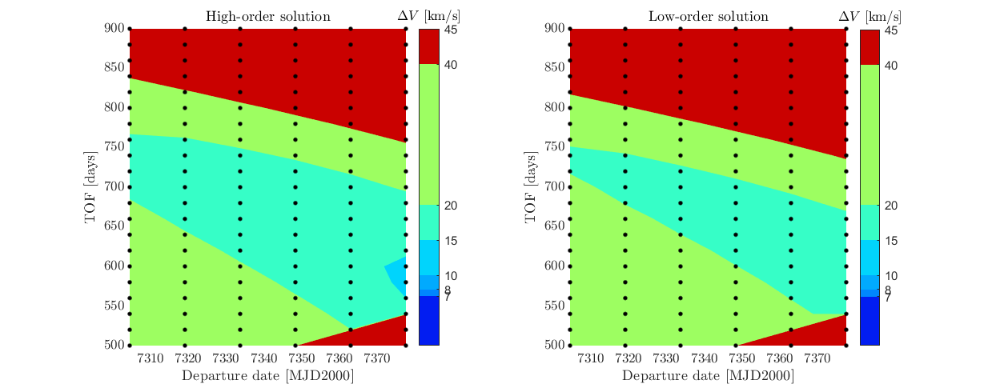

.. _walkthroughsHodographicShapingOptimisation:

Shaping Methods Trajectory Optimisation
=======================================
The example described in this tutorial presents the use of shape-based methods to find the best trajectory to transfer from Earth to Mars. The code for this tutorial is given on Github, and is also located in your Tudat bundle at:

   tudatBundle/tudatExampleApplications/libraryExamples/PaGMOEx/lowThrustTrajectoryExample.cpp

This tutorial presents the optimisation of a shape-based trajectory, using hodographic shaping. As described in more details here :ref:`tudatFeaturesHodographicShaping`, this shaping method allows the user to introduce some extra degrees of freedom in the problem, by adding more base functions than what is required to satisfy the boundary conditions. The weighting coefficients associated with those additional base functions are then free parameters of the problem and can be tuned to minimise the deltaV required by the shaped trajectory. 

In this tutorial, we determine the best departure date and time-of-flight for an Earth-Mars transfer using hodographic shaping to design the trajectory. We first use the lowest-order solution (no additional base functions, so no degree of freedom in the design problem). Then, we optimise the shaped trajectory by introducing some free parameters (high-order solution) while focusing on a reduced search space. 

Set up the trajectory design problem 
~~~~~~~~~~~~~~~~~~~~~~~~~~~~~~~~~~~~

The environment within which the trajectory is to be computed is defined similarly to what is done in the previous tutorials. The central body (Sun) is created using default settings and its position is fixed to the origin of the inertial reference frame. A vehicle body is also created, and its initial mass is specified.

Grid search for the lowest-order solution
~~~~~~~~~~~~~~~~~~~~~~~~~~~~~~~~~~~~~~~~~

Two nested for loops are used to parse the departure date and time-of-flight ranges for hodographically shaped Earth-Mars transfers. The departure dates range from 7304 MJD (Modified Julian Date) to 10225 MJD, while the time-of-flight are constrained between 500 and 2000 days.

.. code-block:: cpp

    std::pair< double, double > departureTimeBounds = std::make_pair( 7304.5 * physical_constants::JULIAN_DAY, 10225.5 * physical_constants::JULIAN_DAY  );
    std::pair< double, double > timeOfFlightBounds = std::make_pair( 500.0 * physical_constants::JULIAN_DAY, 2000.0 * physical_constants::JULIAN_DAY ); 

The time-of-flight step of the grid search is 5 days, while 400 departure dates are parsed from 7304 to 10225 MJD. For each combination of departure date and time-of-flight, different numbers of revolutions are also parsed (N=0-5), and only the one leading to the best trajectory (lowest deltaV) is saved. Because the recommended base functions depend on the value of the time-of-flight and on the number of revolutions, they need to be defined inside the for-loops. More precisely, the base functions of the radial and normal velocity components depend on the time-of-flight only, while the base functions for the axial velocity component also depend on the number of revolutions. For the sake of brevity, and to avoid repeating the same lines of code when defining different base functions, we use the function :literal:`getRecommendedRadialVelocityBaseFunctions` (and equivalent for normal and axial velocity components) to define them with limited coding effort. The global code structure for the grid search is thus the following one:

.. code-block:: cpp

    int numberCases = 0;

    // for-loop parsing the time-of-flight values, ranging from 500 to 2000 days, with a time-step of 5 days.
    for ( int i = 0 ; i <= ( timeOfFlightBounds.second - timeOfFlightBounds.first ) / ( 5.0 * physical_constants::JULIAN_DAY ) ; i++  )
    {
        double currentTOF = timeOfFlightBounds.first + i * 5.0 * physical_constants::JULIAN_DAY;

        // Get recommended base functions for the radial velocity composite function.
        std::vector< std::shared_ptr< shape_based_methods::BaseFunctionHodographicShaping > > radialVelocityFunctionComponents;
        getRecommendedRadialVelocityBaseFunctions( radialVelocityFunctionComponents, freeCoefficientsRadialVelocityFunction, currentTOF );

        // Get recommended base functions for the normal velocity composite function.
        std::vector< std::shared_ptr< shape_based_methods::BaseFunctionHodographicShaping > > normalVelocityFunctionComponents;
        getRecommendedNormalAxialBaseFunctions( normalVelocityFunctionComponents, freeCoefficientsNormalVelocityFunction, currentTOF );

        // for-loop parsing the departure date values, ranging from 7304 MJD to 10225 MJD (with 401 steps)
        for ( int j = 0 ; j <= 400; j++ )
        {
            double currentDepartureDate = departureTimeBounds.first + j * ( departureTimeBounds.second - departureTimeBounds.first ) / 400.0;

            // Compute states at departure and arrival.
            cartesianStateAtDeparture = pointerToDepartureBodyEphemeris->getCartesianState( currentDepartureDate );
            cartesianStateAtArrival = pointerToArrivalBodyEphemeris->getCartesianState( currentDepartureDate + currentTOF );

            int bestNumberOfRevolutions;
            double currentBestDeltaV;

            // Parse shaped trajectories with numbers of revolutions between 0 and 5.
            for ( int currentNumberOfRevolutions = 0 ; currentNumberOfRevolutions <= 5 ; currentNumberOfRevolutions++ )
            {

                // Get recommended base functions for the axial velocity composite function.
                std::vector< std::shared_ptr< shape_based_methods::BaseFunctionHodographicShaping > > axialVelocityFunctionComponents;
                getRecommendedAxialVelocityBaseFunctions( axialVelocityFunctionComponents, freeCoefficientsAxialVelocityFunction, currentTOF,
                                                          currentNumberOfRevolutions );

                // Create hodographically shaped trajectory.
                tudat::shape_based_methods::HodographicShaping hodographicShaping = shape_based_methods::HodographicShaping(
                            cartesianStateAtDeparture, cartesianStateAtArrival, currentTOF, currentNumberOfRevolutions, bodyMap, "Vehicle", "Sun",
                            radialVelocityFunctionComponents, normalVelocityFunctionComponents, axialVelocityFunctionComponents,
                            freeCoefficientsRadialVelocityFunction, freeCoefficientsNormalVelocityFunction, freeCoefficientsAxialVelocityFunction );

                // Save trajectory with the lowest deltaV.
                ...

            }

            // Save results.
            ...

        }
    }

This grid search based on the lowest-order hodographic shaping solution provides the following Porkchop plot (in agreement with the results presented in Gondelach, 2015 (Hodographic-Shaping Method for Low-Thrust Interplanetary Trajectory Design):

.. figure:: images/porkchopHodographicShapingLowOrder.png

Optimisation of the shaped trajectories (high-order solution)
~~~~~~~~~~~~~~~~~~~~~~~~~~~~~~~~~~~~~~~~~~~~~~~~~~~~~~~~~~~~~

Here, we introduce two degrees of freedom to the trajectory design problem, by adding two extra base functions to the composite function mapping the radial velocity component. We then want to optimise their values to minimise the deltaV required by the trajectory. Because of the computational load of the optimisation process, a reduced search space is considered here. The departure dates range from 7304 to 7379 MJD, while the time-of-flight search space is reduced to the [200d;900d] interval.

.. note:: 

	Only the definition of the base functions used to shape the radial velocity component is modified compared to the lowest-order grid search presented above.

Still, the global structure is similar to the one presented for the lowest-order solution presented in the first part of this tutorial. One major difference is that we no longer iterate on the number of revolutions to find the one leading the best trajectory, but the number of revolutions is now set to 1 (again, to reduce the computational load). The code is written as follows

.. code-block:: cpp

    numberCases = 0;

    // Define lower and upper bounds for the radial velocity free coefficients.
    std::vector< std::vector< double > > bounds( 2, std::vector< double >( 2, 0.0 ) );
    bounds[ 0 ][ 0 ] = - 600.0;
    bounds[ 1 ][ 0 ] = 800.0;
    bounds[ 0 ][ 1 ] = 0.0;
    bounds[ 1 ][ 1 ] = 1500.0;

    // Set fixed number of revolutions.
    int numberOfRevolutions = 1;

    std::map< int, Eigen::Vector4d > hodographicShapingResultsHigherOrder;
    std::map< int, Eigen::Vector4d > hodographicShapingResultsLowResultOneRevolution;

    // for-loop parsing the time-of-flight values, ranging from 500 to 900 days, with a time-step of 20 days.
    for ( int i = 0 ; i <= ( 900.0 * physical_constants::JULIAN_DAY - timeOfFlightBounds.first ) / ( 20 * physical_constants::JULIAN_DAY ) ; i++  )
    {
        double currentTOF = timeOfFlightBounds.first + i * 20.0 * physical_constants::JULIAN_DAY;

        double frequency = 2.0 * mathematical_constants::PI / currentTOF;
        double scaleFactor = 1.0 / currentTOF;

        // Define settings for the two additional base functions for the radial velocity composite function.
        ...

        // Get recommended base functions for the radial velocity composite function, and add two additional base functions
        // (introducing two degrees of freedom in the trajectory design problem).
        ...

        // Get recommended base functions for the normal velocity composite function.
        ... 

        // for-loop parsing departure dates ranging from 7304 MJD to 7379 MJD (with a time-step of 15 days).
        for ( int j = 0 ; j <= ( 7379.5 * physical_constants::JULIAN_DAY - departureTimeBounds.first ) / ( 15 * physical_constants::JULIAN_DAY ); j++ )
        {
            double currentDepartureDate = departureTimeBounds.first +
                    j * 15.0 * physical_constants::JULIAN_DAY;

            // Compute states at departure and arrival.
            cartesianStateAtDeparture = pointerToDepartureBodyEphemeris->getCartesianState( currentDepartureDate );
            cartesianStateAtArrival = pointerToArrivalBodyEphemeris->getCartesianState( currentDepartureDate + currentTOF );

            // Get recommended base functions for the axial velocity composite function.
            ...

            // Create hodographic shaping optimisation problem.
            ...
	
	    // Perform optimisation.
            ...

            // Save high-order shaping solution.
            ...

            // Compute corresponding low-order hodographic shaping solution.
            ...

            // Save low-order shaping solution.
            ... 

            numberCases++;

        }
    }

    
Focusing first on the definition of the base functions for the radial velocity components, five of them are defined in this example. Two extra base functions are added to the three recommended base functions used in the lowest-order solution. This adds two degrees of freedom, since three base functions are required to satisfy the boundary conditions in the radial direction. The following piece of code is used to define those five radial base functions:

.. code-block:: cpp

        // Define settings for the two additional base functions for the radial velocity composite function.
        std::shared_ptr< shape_based_methods::BaseFunctionHodographicShapingSettings > fourthRadialVelocityBaseFunctionSettings =
                std::make_shared< shape_based_methods::PowerTimesTrigonometricFunctionHodographicShapingSettings >( 1.0, 0.5 * frequency, scaleFactor );
        std::shared_ptr< shape_based_methods::BaseFunctionHodographicShapingSettings > fifthRadialVelocityBaseFunctionSettings =
                std::make_shared< shape_based_methods::PowerTimesTrigonometricFunctionHodographicShapingSettings >( 1.0, 0.5 * frequency, scaleFactor );

        // Get recommended base functions for the radial velocity composite function, and add two additional base functions
        // (introducing two degrees of freedom in the trajectory design problem).
        std::vector< std::shared_ptr< shape_based_methods::BaseFunctionHodographicShaping > > radialVelocityFunctionComponents;
        getRecommendedRadialVelocityBaseFunctions( radialVelocityFunctionComponents, freeCoefficientsRadialVelocityFunction, currentTOF );
        radialVelocityFunctionComponents.push_back(
                    createBaseFunctionHodographicShaping( shape_based_methods::scaledPowerSine, fourthRadialVelocityBaseFunctionSettings ) );
        radialVelocityFunctionComponents.push_back(
                    createBaseFunctionHodographicShaping( shape_based_methods::scaledPowerCosine, fifthRadialVelocityBaseFunctionSettings ) );

The base functions for the normal and axial velocity shaping functions are defined exactly as it was done in the lowest-order solution case. Then, for each combination of time-of-flight and departure date, the hodographically shaped trajectory has to be optimised. The hodographic shaping optimisation problem has been implemented in the class :literal:`HodographicShapingOptimisationProblem` (see :ref:`tudatFeaturesHodographicShapingOptimisation` for more details). Creating an object of this class automatically creates a PAGMO compatible optimisation problem whose design parameters are the free coefficients of the hodographic shaping method, and which aims at minimising the deltaV of the trajectory.

.. code-block:: cpp

	// Create hodographic shaping optimisation problem.
        problem prob{ HodographicShapingOptimisationProblem( cartesianStateAtDeparture, cartesianStateAtArrival, currentTOF, numberOfRevolutions,
                                                             bodyMap, "Vehicle", "Sun", radialVelocityFunctionComponents,
                                                             normalVelocityFunctionComponents,
                                                             axialVelocityFunctionComponents, bounds ) };

Once the optimisation problem has been defined, the selection of the algorithm, the creation of the Island and the solving of the optimisation problem itself are done in a very similar manner to what is presented in the previous optimisation tutorials:

.. code-block:: cpp

    algorithm algo{ pagmo::sga( ) };

    // Create an island with 1024 individuals
    island isl{ algo, prob, 1024 };

    // Evolve for 100 generations
    for( int i = 0 ; i < 10; i++ )
    {
        isl.evolve( );
        while( isl.status( ) != pagmo::evolve_status::idle &&
               isl.status( ) != pagmo::evolve_status::idle_error )
        {
            isl.wait( );
        }
        isl.wait_check( ); // Raises errors
    }

The results obtained after optimising the shaped trajectory over the reduced search space are the following ones:

The use of a global evolutionary algorithm (genetic algorithm) here is not ideal to tackle this kind of optimisation problem and thus does not guarantee convergence. Local optimizers are known to perform better in that case (Stubbig, 2019), but the NLOPT library used in PAGMO for local optimisation encounters issues when run on Windows, so that global optimisation has been used in this tutorial for system compatibility. However, it is still sufficient to see that introducing some degrees of freedom in the trajectory design can reduce the deltaV budget and thus leads to better preliminary designs.

Results
~~~~~~~ 

The output of the application should look as follows:

.. code-block:: cpp

	Starting C:\tudatBundle\tudatExampleApplications\libraryExamples\bin\applications\application_PagmoLowThrustTrajectoryExample.exe...
	C:/tudatBundle/tudatExampleApplications/libraryExamples/bin/applications/application_PagmoLowThrustTrajectoryExample.exe exited with code 0

