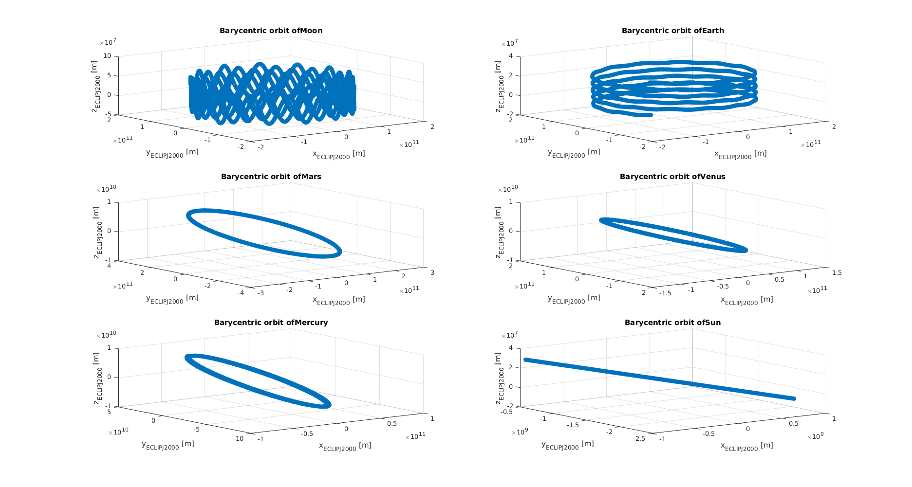
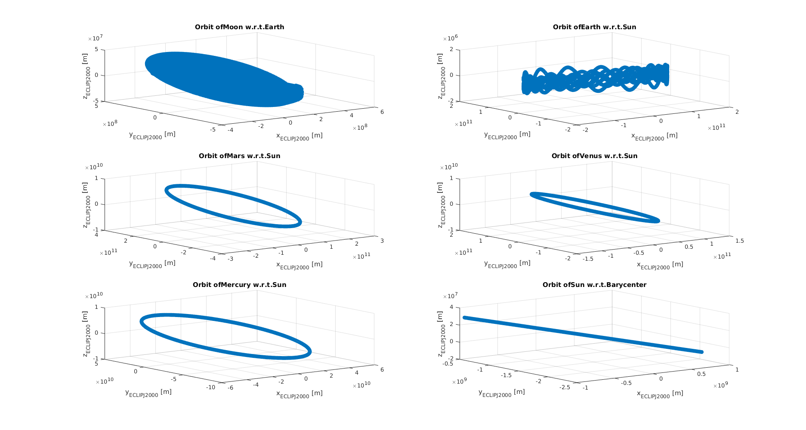

.. _walkthroughsInnerSolarSystemPropagation:

Inner Solar System Propagation
==============================
The example described on this page aims to simulate the dynamics of the main celestial bodies in the inner solar system. The code for this tutorial is given on Github, and is also located in your Tudat bundle at::

   tudatBundle/tudatExampleApplications/satellitePropagatorExamples/SatellitePropagatorExamples/innerSolarSystemPropagation.cpp

For this example, we have the following problem statement:

   *Given the position and velocity of the main celestial bodies in the inner solar system at a certain point in time, what will their position and velocity after a certain period of time?*

.. warning:: The example described in this page assumes that the user has read the :ref:`walkthroughsUnperturbedEarthOrbitingSatellite`. This page only describes the differences with respect to such example, so please go back before proceeding.

Set Up the Environment
~~~~~~~~~~~~~~~~~~~~~~
The first step is to define the bodies that will be propagated, which are stored hierarchically in a moons to stars fashion. The reason why this is done will become clear later:

.. code-block:: cpp

    // Define bodies in simulation.
    unsigned int totalNumberOfBodies = 6;
    std::vector< std::string > bodyNames;
    bodyNames.resize( totalNumberOfBodies );
    bodyNames[ 0 ] = "Moon";
    bodyNames[ 1 ] = "Earth";
    bodyNames[ 2 ] = "Mars";
    bodyNames[ 3 ] = "Venus";
    bodyNames[ 4 ] = "Mercury";
    bodyNames[ 5 ] = "Sun";

The next step is to save such bodies in the :literal:`bodyMap` and set the global ephemerides:

.. code-block:: cpp

    // Create bodies needed in simulation
    std::map< std::string, std::shared_ptr< BodySettings > > bodySettings =
            getDefaultBodySettings( bodyNames );
    NamedBodyMap bodyMap = createBodies( bodySettings );
    setGlobalFrameBodyEphemerides( bodyMap, "SSB", "ECLIPJ2000" );

Set Up the Acceleration Models
~~~~~~~~~~~~~~~~~~~~~~~~~~~~~~
The example explained in this page is slightly different than all the previous examples, since two simulations are performed within the same application:

   1. The Solar System Barycenter (SSB) is considered as the central body for all the propagated celestial bodies.
   2. The propagated celestial bodies consider the higher hierarchical body as their respective central body. (Moon > Earth; Mercury, Venus, Earth, Mars > Sun; Sun > SSB).

These two simulations result in two different output files. Consequently, all the steps required to create a :class:`DynamicsSimulator` are performed twice, as shown by the following :literal:`for` loop:

.. code-block:: cpp

    // Run simulation for 2 different central body settings (barycentric and hierarchical)
    for( int centralBodySettings = 0; centralBodySettings < 2; centralBodySettings++ )
    {
        ///////////////////////////////////////////////////////////////////////////////////////////////////////////////////
        ///////////////////////             CREATE ACCELERATIONS            ///////////////////////////////////////////////
        ///////////////////////////////////////////////////////////////////////////////////////////////////////////////////

        // Set accelerations between bodies that are to be taken into account (mutual point mass gravity between all bodies).
        SelectedAccelerationMap accelerationMap;
        for( unsigned int i = 0; i < bodyNames.size( ); i++ )
        {
            std::map< std::string, std::vector< std::shared_ptr< AccelerationSettings > > > currentAccelerations;
            for( unsigned int j = 0; j < bodyNames.size( ); j++ )
            {
                // Create central gravity acceleration between each 2 bodies.
                if( i != j )
                {
                    currentAccelerations[ bodyNames.at( j ) ].push_back(
                                std::make_shared< AccelerationSettings >( central_gravity ) );
                }
            }
            accelerationMap[ bodyNames.at( i ) ] = currentAccelerations;
        }

The first step in the :literal:`for` loop is to create the acceleration models. The only acceleration model used in this example is the :literal:`central_gravity` model, which in this case acts on all bodies from all bodies. The :literal:`if` condition shown above ensures that the gravity field model of a body does not act on itself.

.. note:: The reason behind having two different simulations is merely for illustration purposes and is not a requirement when simulating the Solar System dynamics.

Set up the propagation settings
~~~~~~~~~~~~~~~~~~~~~~~~~~~~~~~
The next step found in the :literal:`for` loop is to create the list with the :literal:`bodiesToPropagate`. Contrary to the :ref:`walkthroughsPerturbedEarthOrbitingSatellite` example, in this case all the bodies in the :literal:`bodyMap` are propagated:

.. code-block:: cpp

   // Define list of bodies to propagate
   std::vector< std::string > bodiesToPropagate = bodyNames;
   unsigned int numberOfNumericalBodies = bodiesToPropagate.size( );

Since all bodies require a central body, a placeholder is created for each body:

.. code-block:: cpp

   // Define central bodies to use in propagation.
   std::vector< std::string > centralBodies;
   centralBodies.resize( numberOfNumericalBodies );

where each place holder is filled depending on which simulation is being executed. The first part of the following :literal:`if` loop corresponds to Simulation 1 and the second part (the :literal:`else if` loop) corresponds to Simulation 2:

.. code-block:: cpp

   // Set central body as Solar System Barycente for each body
   if( centralBodySettings == 0 )
   {
      for( unsigned int i = 0; i < numberOfNumericalBodies; i++ )
      {
         centralBodies[ i ] = "SSB";
      }
   }
   else if( centralBodySettings == 1 )
   {
      for( unsigned int i = 0; i < numberOfNumericalBodies; i++ )
      {
         // Set Earth as central body for Moon
         if( i == 0 )
         {
            centralBodies[ i ] = "Earth";
         }
         // Set barycenter as central 'body' for Sun
         else if( i == 5 )
         {
            centralBodies[ i ] = "SSB";
         }
         // Set Sun as central body for all planets
         else
         {
            centralBodies[ i ] = "Sun";
         }
      }
   }

Once the :literal:`centralBodies` have been set, the creation of the :class:`AccelerationMap` can be finalized:

.. code-block:: cpp

   // Create acceleration models and propagation settings.
   AccelerationMap accelerationModelMap = createAccelerationModelsMap(
               bodyMap, accelerationMap, bodiesToPropagate, centralBodies );

The next step in the :literal:`for` loop is to define the propagation time. In this example, the orbits of the inner solar system bodies are initiated :math:`10^7` seconds after J2000 and are propagated for five Julian years:

.. code-block:: cpp

   // Specify initial time.
   double initialEphemerisTime = 1.0E7;
   double finalEphemerisTime = 1.0E7 + 5.0 * physical_constants::JULIAN_YEAR;

   // Get initial state vector as input to integration.
   Eigen::VectorXd systemInitialState = getInitialStatesOfBodies(
      bodiesToPropagate, centralBodies, bodyMap, initialEphemerisTime );

   // Define propagator settings.
   std::shared_ptr< TranslationalStatePropagatorSettings< double > > propagatorSettings =
      std::make_shared< TranslationalStatePropagatorSettings< double > >
         ( centralBodies, accelerationModelMap, bodiesToPropagate, systemInitialState, finalEphemerisTime );

Once this step is completed, the :class:`DynamicsSimulator` object is created and the equations of motion are integrated. Once again, this step is within the :literal:`for` loop, thus this step is performed twice:

.. code-block:: cpp

   // Create simulation object and propagate dynamics.
   SingleArcDynamicsSimulator< > dynamicsSimulator(
      bodyMap, integratorSettings, propagatorSettings, true, false, false );

.. tip:: Please go to :ref:`tudatFeaturesSimulatorCreation` for further details on the :class:`DynamicsSimulator` and derived classes.

Save the propagation results
****************************
The final step in the :literal:`for` loop is to save the propagation results to a file. First, the propagation history is retrieved from the :literal:`dynamicsSimulator`:

.. code-block:: cpp

   std::map< double, Eigen::VectorXd > integrationResult = dynamicsSimulator.getEquationsOfMotionNumericalSolution( );

where the retrieved result is an :literal:`std::map` with a :literal:`double` as key (the simulation time) and a :literal:`Eigen::VectorXd` of 1x36 elements, containing the 6-variable state for the six bodies. Next, a :literal:`std::vector` is created where each of its elements is an :literal:`std::map` that contains the propagation history of a single body:

.. code-block:: cpp

   // Retrieve numerically integrated state for each body.
   std::vector< std::map< double, Eigen::VectorXd > > allBodiesPropagationHistory;
   allBodiesPropagationHistory.resize( numberOfNumericalBodies );

   for( std::map< double, Eigen::VectorXd >::const_iterator stateIterator = integrationResult.begin( );
         stateIterator != integrationResult.end( ); stateIterator++ )
   {
      for( unsigned int i = 0; i < numberOfNumericalBodies; i++ )
      {
         allBodiesPropagationHistory[ i ][ stateIterator->first ] = stateIterator->second.segment( i * 6, 6 );
      }
   }

Finally, each of the :literal:`std::map` within :literal:`allBodiesPropagationHistory` are written to individual :literal:`.dat` files using the :literal:`writeDataMapToFile` as discussed in :ref:`tudatFeaturesInputOutput`:

.. code-block:: cpp

   for( unsigned int i = 0; i < numberOfNumericalBodies; i++ )
   {
      // Write propagation history to file.
      input_output::writeDataMapToTextFile(
         allBodiesPropagationHistory[ i ],
         "innerSolarSystemPropagationHistory" + bodyNames.at( i ) +
         boost::lexical_cast< std::string >( centralBodySettings ) + ".dat",
         tudat_applications::getOutputPath( ),
         "",
         std::numeric_limits< double >::digits10,
         std::numeric_limits< double >::digits10,
         "," );
  }

Results
~~~~~~~
The orbit of the propagated bodies are shown below. First the orbits are shown in the inertial frame. Then case 1 is shown first where the Solar System Barycenter is considered as the central body. Finally case 2 where the higher hierarchical body is used as respective central body.

.. figure:: images/InnerSolarSystemOverview.png

.. tip:: Open the figure(s) in a new tab for more detail.