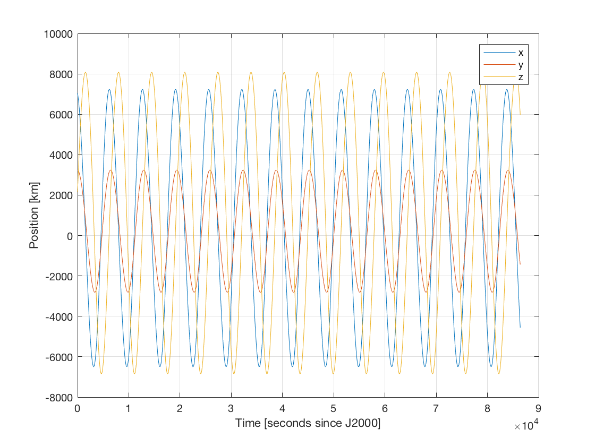

.. _jsonInterface_tutorials_basicPropagation:

.. role:: jsontype
.. role:: jsonkey

Unperturbed Earth-orbiting Satellite
====================================

This page describes how to set up the propagation of the unperturbed Earth-orbiting satellite described in :ref:`walkthroughsUnperturbedEarthOrbitingSatellite` using the :literal:`json_interface`.

The first step is to define the file tree. Since this is a simple example, there is no need to split the root input file into several files. Thus, we will have just a single file called :class:`main.json`, as shown at the end of this tutorial.

General Settings
~~~~~~~~~~~~~~~~

We define the key :jsonkey:`initialEpoch` at root level, which will be used as initial time for the integrator and for interpolation of the Spice ephemeris. We also define the key :jsonkey:`finalEpoch`, which is used for interpolation of the Spice ephemeris and to create a time-based termination condition. In both cases, we need to specify the values in seconds since J2000. In this case, :jsonkey:`globalFrameOrigin` is not specified, so the default value of :literal:`"SSB"` (Solar system barycentre) is used. The :jsonkey:`globalFrameOrientation` is set to :literal:`J2000`.

Then, we request using the standard Spice kernels, namely :class:`pck00010.tpc`, :class:`gm_de431.tpc`, :class:`de430_small.bsp` and :class:`pck00010.tpc`. We do this by defining the key :jsonkey:`spice` to be:

   .. code-block:: json

      {
         "useStandardKernels": true,
         "preloadEphemeris": false
      }

where we disabled preloading of the ephemeris of the celestial bodies from the period :jsonkey:`initialEpoch` to :jsonkey:`finalEpoch`.

Body Settings
~~~~~~~~~~~~~

The next step is to define the body settings. In this case, only Earth and the orbiting body (named :jsonkey:`Asterix`) are considered. Thus, we set the key :jsonkey:`bodies` to be:

   .. code-block:: json

      {
         "Earth": {
            "useDefaultSettings": true,
            "ephemeris": {
               "type": "constant",
               "constantState": [ 0, 0, 0, 0, 0, 0 ],
               "frameOrientation": "J2000"
            }
         },
         "Asterix": {
            "initialState": {
               "type": "keplerian",
               "semiMajorAxis": 7.5E+6,
               "eccentricity": 0.1,
               "inclination": 1.4888,
               "argumentOfPeriapsis": 4.1137,
               "longitudeOfAscendingNode": 0.4084,
               "trueAnomaly": 2.4412
            }
         }
      }

The first body, :jsonkey:`Earth`, has the key :jsonkey:`useDefaultSettings` set to :literal:`true`, which means that its properties (such as gravitational parameter) will be loaded automatically. For this simple propagation, since we are not considering additional celestial bodies, we can place Earth anywhere, e.g. in the global frame origin (i.e. in the Solar system barycentre). We do that by defining :jsonkey:`bodies.Earth.ephemeris` to be of type :literal:`constant` and we use a constant zero state (we also assume it is stationary). The order in which the keys :jsonkey:`useDefaultSettings` and :jsonkey:`ephemeris` are defined inside the :jsonkey:`bodies.Earth` objects is irrelevant: the default settings will always be loaded first, and then the settings specified in the input file (if any) will override the default ones.

The second body, :jsonkey:`Asterix`, does not specify the key :jsonkey:`useDefaultSettings`, which defaults to :literal:`false`. Thus, no properties will be loaded from Spice. Since no perturbations are considered in this propagation, we need not specify a mass or aerodynamic properties. Thus, we only need to provided an :jsonkey:`initialState`. We can provide directly a vector with the Cartesian components, or an object defining the different keys of a Keplerian state, as shown above.

Propagation Settings
~~~~~~~~~~~~~~~~~~~~

Then, we specify the propagator settings. In this case, we are going to propagate the translational state of :jsonkey:`Asterix` about :jsonkey:`Earth`, so we define the key :jsonkey:`propagators` to be:

   .. code-block:: json

      [
         {
            "integratedStateType": "translational",
            "centralBodies": [ "Earth" ],
            "bodiesToPropagate": [ "Asterix" ],
            "accelerations": {
               "Asterix": {
                  "Earth": [
                     {
                        "type": "pointMassGravity"
                     }
                  ]
               }
            }
         }
      ]

We specify the key :jsonkey:`propagators[ 0 ].accelerations`, an object containing lists of accelerations. The inner keys (in this case, :jsonkey:`Earth`) are the names of the bodies exerting the accelerations, while the outer keys (in this case, :jsonkey:`Asterix`), are the names of the bodies undergoing the accelerations. Thus, :jsonkey:`accelerations.Asterix.Earth` is read as "accelerations on Asterix caused by Earth". In this case, the only acceleration is Earth's point-mass gravity.

In this case, some keys of :jsonkey:`propagators[ 0 ]` have been omitted. For instance, the key :literal:`type` has not been specified, meaning that the default value :literal:`"cowell"` is used.

Integration Settings
~~~~~~~~~~~~~~~~~~~~

The next step is to define the integrator settings. The initial time is retrieved from the key :jsonkey:`initialEpoch` defined at root level, so it is sufficient to define the key :jsonkey:`integrator` to be equal to the following object:

   .. code-block:: json

      {
         "type": "rungeKutta4",
         "stepSize": 10
      }

The key :jsonkey:`saveFrequency` is not specified, so the save frequency is assumed to be :literal:`1`, which means that all the steps are saved.

Output Settings
~~~~~~~~~~~~~~~

Then, we have to define the files to which the results of the integration should be saved. We do this by assigning an array of objects containing export settings to the :jsonkey:`export` key:

   .. code-block:: json

      [
         {
            "file": "@path(stateHistory.txt)",
            "variables": [
               {
                  "type": "state"
               }
            ]
         }
      ]

Here, each element in the array will result in the generation of a different output file; in this case, only one file (:class:`stateHistory.txt` in the same directory as the input file) will be created. This file will contain a matrix of results, where each row corresponds to an epoch. The key :jsonkey:`epochsInFirstColumn` defaults to :literal:`true`, which means that the first column of the matrix will contain the epochs, and subsequent columns will contain the values of the variables specified in the key :jsonkey:`variables`. In this case, only the state (of the propagated body).

Running the Simulation
~~~~~~~~~~~~~~~~~~~~~~

We can now carry out the propagation. However, if we want a file containing all the settings actually used by Tudat to be generated (including all default settings), we must specify the :jsonkey:`options` key to be:

   .. code-block:: json

      {
         "fullSettingsFile": "@path(fullSettings.json)"
      }

The resulting input file, containing all the settings, will be:

.. literalinclude:: main.json
  :linenos:
  :language: json
  :caption: :class:`main.json`
  :name: main-json

After running in Terminal the following command::

   json_inteface main.json

we will get a :class:`stateHistory.txt` file containing the results, and a :class:`fullSettings.json` file containing default settings and with some keys moved to a different place (e.g. :jsonkey:`bodies.Asterix.initialState` to :jsonkey:`propagators[0].initialStates`):

.. literalinclude:: fullSettings.json
  :linenos:
  :language: json
  :caption: :class:`fullSettings.json`
  :name: fullSettings-json

Results
~~~~~~~

Finally, we can plot the results using the following MATLAB script:

.. literalinclude:: plotResults.m
  :linenos:
  :language: matlab
  :caption: :class:`plotResults.m`
  :name: plotResults-m

