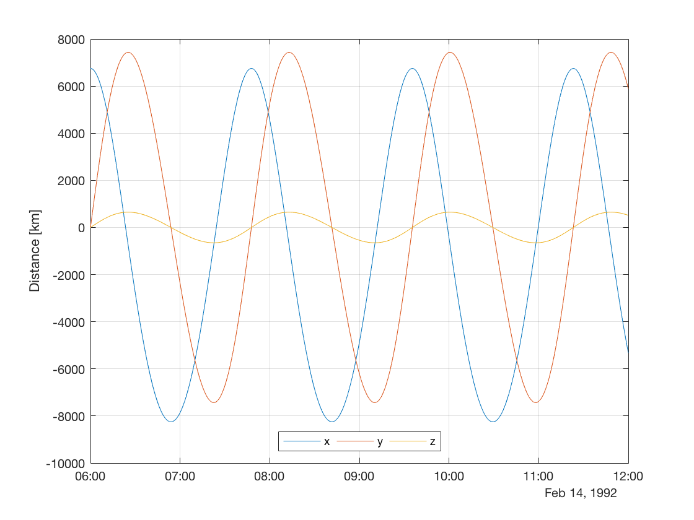

.. _matlabInterface_tutorialsSeamless_basicPropagation:

Unperturbed Earth-orbiting Satellite
====================================

This tutorial describes how to propagate the orbit of an unperturbed satellite about Earth using the MATLAB Interface, similar (but not identical) to the example :ref:`walkthroughsUnperturbedEarthOrbitingSatellite` written in C++. The code for this example can be found at:

.. code-block:: txt

  tudatBundle/matlabInterface/Examples/Seamless/basicPropagation.m

The first step is to include the source code of the MATLAB Interface into MATLAB's path in the current session so that all the classes needed to set up the simulation can be accessed. This is done by writing:

.. code-block:: matlab

  tudat.load();

Now, we create a :class:`Simulation` object and specify the initial and final epochs:

.. code-block:: matlab

  simulation = Simulation();
  simulation.initialEpoch = convert.dateToEpoch('1992-02-14 06:00');
  simulation.finalEpoch = convert.dateToEpoch('1992-02-14 12:00');

Note that the function :literal:`dateToEpoch` from the :literal:`convert` package has been used. This function convert a date to seconds since J2000.

Next, we create the bodies. For an unperturbed orbit, the mass of the satellite is irrelevant, so we create a body named :literal:`satellite` with the following initial state:

.. code-block:: matlab

  satellite = Body('satellite');
  satellite.initialState.semiMajorAxis = 7500e3;
  satellite.initialState.eccentricity = 0.1;
  satellite.initialState.inclination = deg2rad(5);

Note that some of the Keplerian components have been omitted, and thus they are assumed to be zero. The semi-major axis cannot be omitted when providing a Keplerian state.

Now, we add the bodies to the simulation by calling the method :literal:`addBodies` of the :literal:`simulation` object. There exist predefined objects for celestial bodies (namely the Sun, the Moon and the eight planets), so these objects can be added directly without the need to specify their properties:

.. code-block:: matlab

  simulation.addBodies(Earth,satellite);

In this case, we use the pre-defined body :literal:`Earth`, which is basically a :class:`Body` object named :literal:`Earth` with the property :literal:`useDefaultSettings` set to :literal:`true`.

Then, we create the settings for the propagation. We are going to propagate the translational state of the body :literal:`satellite` about :literal:`Earth`. Thus, we use a :class:`TranslationalPropagator`:

.. code-block:: matlab

  propagator = TranslationalPropagator();
  propagator.bodiesToPropagate = {satellite};
  propagator.centralBodies = {Earth};

Now we need to specify the accelerations acting on :literal:`satellite`. The only accelerations are those caused by :literal:`Earth`, so we need to specify the property :literal:`propagator.accelerations.satellite.Earth`, which can be read as "accelerations on satellite caused by Earth". In the case of an unperturbed orbit, the only acceleration is the point-mass gravitational attraction of the central body:

.. code-block:: matlab

  propagator.accelerations.satellite.Earth = {PointMassGravity()};

Finally, we add the :literal:`propagator` to the :literal:`simulation` object and define the integrator settings:

.. code-block:: matlab

  simulation.propagators = {propagator};
  
  simulation.integrator.type = Integrators.rungeKutta4;
  simulation.integrator.stepSize = 10;

In this case we use a Runge-Kutta 4 integrator with a fixed step-size of 10 seconds.

All the settings needed to run the simulation have been defined. Thus, we can write:

.. code-block:: matlab

  simulation.run();

This method creates a temporary input file and calls the :literal:`json_interface` application, generating a temporary output file containing the state of the satellite for each integration step. Then, it loads these results into the struct :literal:`results` of the :literal:`simulation` object. Finally, all the temporary files are deleted.

After running the simulation, if no specific results have been requested, we can obtain the numerical solution of the equations of motion from :literal:`simulation.results.numericalSolution`. This is a matrix containing in each row the results of an integration step. The first column contains the epochs, while the columns 2 to 7 contain the associated Cartesian states of the satellite.

We can use the results to generate a plot of the x, y and z components of the position of the satellite:

.. code-block:: matlab

  t = simulation.results.numericalSolution(:,1);
  r = simulation.results.numericalSolution(:,2:4);
  plot(convert.epochToDate(t),r/1e3);
  grid on;
  ylabel('Distance [km]');
  legend('x','y','z','Location','South','Orientation','Horizontal');

