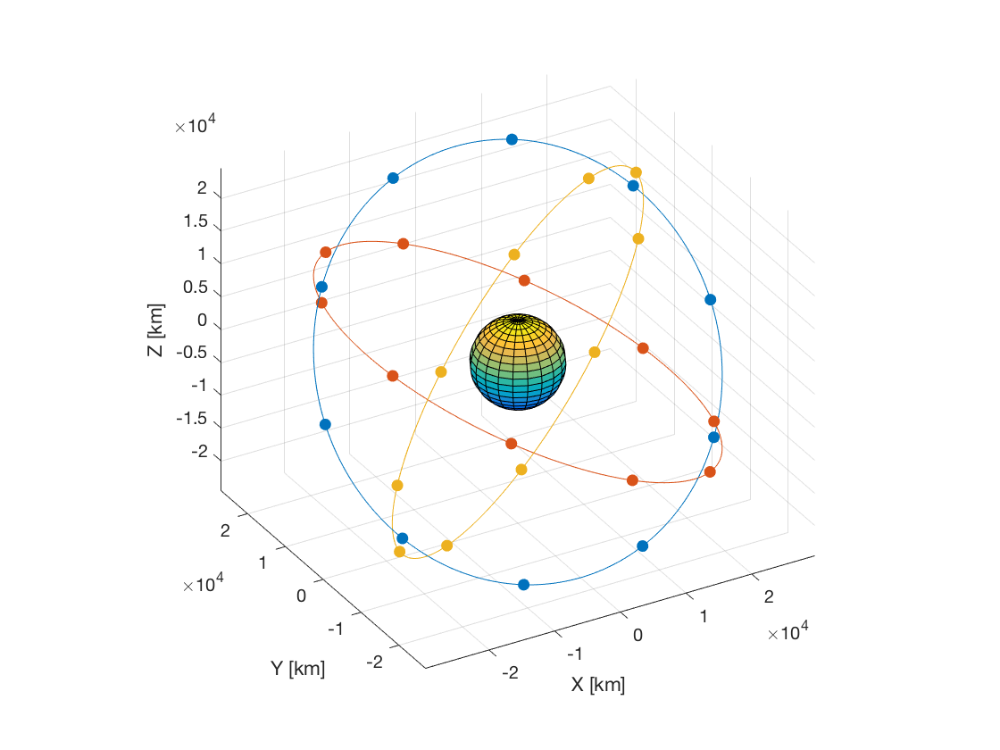

.. _matlabInterface_tutorialsSeamless_galileoConstellation:

Galileo Constellation Propagation
=================================

This tutorial describes how to propagate the orbit of the satellites of the Galileo constellation using the MATLAB Interface. The code for this example can be found at:

.. code-block:: txt

  tudatBundle/matlabInterface/Examples/Seamless/galileoConstellation.m

The first step is to include the source code of the MATLAB Interface into MATLAB's path in the current session so that all the classes needed to set up the simulation can be accessed. This is done by writing:

.. code-block:: matlab

  tudat.load();

Now, we create a :class:`Simulation` object and specify the initial and final epochs and the global frame orientation:

.. code-block:: matlab

  simulation = Simulation(0,convert.toSI(1,'d'),'SSB','J2000');
  simulation.spice.preloadEphemeris = false;

In this case, the simulation ranges from J2000 to 1 day later, using the solar system barycentre as the global frame origin and J2000 as global frame orientation. We disable preloading ephemeris of the celestial bodies from Spice because the only celestial body is Earth, so we can set its ephemeris to be constant and equal to a zero vector.

Next, we create the 30 satellites of the Galileo constellation, which are distributed in three orbital planes, and add them to the :literal:`simulation` object:

.. code-block:: matlab

  numberOfSatellites = 30;
  numberOfPlanes = 3;
  numberOfSatellitesPerPlane = numberOfSatellites/numberOfPlanes;
  for i = 1:numberOfSatellites
      simulation.addBodies(Body(sprintf('Satellite%i',i)));
  end
  satelliteNames = fieldnames(simulation.bodies);

We also retrieve a cell array containing the names of the bodies we have just created. The names of the bodies are :literal:`Satellite1`, :literal:`Satellite2`, ... :literal:`Satellite30`.

The next step is to add the body :literal:`Earth`, using the predefined celestial body. Then, we redefine some of its properties (which will override the default settings loaded by Tudat), namely the ephemeris, which will be constant and equal to :literal:`[0 0 0 0 0 0]` and we have to make its frame orientation coincide with the global frame orientation:

.. code-block:: matlab

  simulation.addBodies(Earth);
  simulation.bodies.Earth.ephemeris = ConstantEphemeris(zeros(6,1));
  simulation.bodies.Earth.ephemeris.frameOrientation = 'J2000';

Now we need to specify the initial stat for each satellite. The semi-major axis (29600.1 km), eccentricity (0), inclination (56 deg) and argument of perigee (0) are the same for all the satellites. However, the longitude of the ascending nodes and the true anomalies aren't:

.. code-block:: matlab

  raans = mod(floor(((1:numberOfSatellites)-1)/numberOfSatellitesPerPlane),numberOfPlanes)*360/numberOfPlanes;
  trueAnomalies = mod((1:numberOfSatellites)-1,numberOfSatellitesPerPlane)*360/numberOfSatellitesPerPlane;

For this case, :literal:`raans` is a vector containing the initial longitudes of the ascending nodes for each satellite, namely :literal:`0` for the first 10, :literal:`120` for satellites 11 to 20, and :literal:`240` for satellites 21 to 30. For each orbital plane, the satellites are evenly distributed, so the :literal:`trueAnomalies` vector is simply :literal:`linspace(0,360-360/10,10)` repeated 3 times (one for each orbital plane).

We set the initial state of each satellite by writing:

.. code-block:: matlab

  for i = 1:numberOfSatellites
      satellite = simulation.bodies.(satelliteNames{i});
      satellite.initialState.semiMajorAxis = 23222e3 + 6378.1e3;
      satellite.initialState.inclination = deg2rad(56);
      satellite.initialState.longitudeOfAscendingNode = deg2rad(raans(i));
      satellite.initialState.trueAnomaly = deg2rad(trueAnomalies(i));
  end

Note that in the first line inside the loop, a :class:`Body` object is assigned to the variable :literal:`satellite`. Since the :class:`Body` class derives from :class:`handle`, updating :literal:`satellite` also updates automatically :literal:`simulation.bodies.(satelliteNames{i})`.

Then, we create the settings for the propagation. We are going to propagate the translational state of the satellites. Thus, we use a :class:`TranslationalPropagator`, and specify the accelerations acting on each body. The only acceleration acting on each body is just Earth's spherical-harmonics gravitational attraction. We can define all the accelerations by writing a for-loop:

.. code-block:: matlab

  propagator = TranslationalPropagator();
  propagator.bodiesToPropagate = satelliteNames;
  propagator.centralBodies = repmat({'Earth'},1,numberOfSatellites);
  for i = 1:numberOfSatellites
      propagator.accelerations.(satelliteNames{i}).Earth = {SphericalHarmonicGravity(4,0)};
  end
  simulation.propagators = {propagator};

Note that the body :literal:`Earth` is taken as central body for all the satellites.

Then, we define the integrator settings, in this case we use a Runge-Kutta 4 integrator with a fixed step-size of 30 seconds:

.. code-block:: matlab
  
  simulation.integrator.type = Integrators.rungeKutta4;
  simulation.integrator.stepSize = 30;

Finally, we define the results to be saved. In this case, we are only interested in the relative position of each satellite with respect to Earth (and the corresponding epochs). Although this information could be retrieved from the matrix :literal:`simulation.results.numericalSolution` after running the simulation, we would need to determine which are the columns that correspond to the Cartesian position of each satellite. This is not difficult to do (using a loop, for instance), but we can avoid it by asking to save the following 30 variables:

.. code-block:: matlab

  for i = 1:numberOfSatellites
      simulation.addResultsToSave(sprintf('r%i',i),sprintf('%s.relativePosition-Earth',satelliteNames{i}));
  end

In this way, after running the simulation, we will be able to retrieve the relative positions of e.g. :literal:`Satellite14` from :literal:`simulation.results.r14`.

All the settings needed to run the simulation have been defined. Thus, we can write:

.. code-block:: matlab

  simulation.run();

This method creates a temporary input file and calls the :literal:`json_interface` application, generating a temporary output file containing the requested results. Then, it loads these results into the struct :literal:`results` of the :literal:`simulation` object. Finally, all the temporary files are deleted.

We can now generate a 3D plot showing the orbits of the satellites (by plotting the positions of the satellites for all the integration epochs) and we also add the body Earth (to scale, using its average radius) and the final positions of the 30 satellites of the Galileo constellation:

.. code-block:: matlab

  % 3D plot of orbits
  colorIndices = mod(floor(((1:numberOfSatellites)-1)/numberOfSatellitesPerPlane),numberOfPlanes) + 1;
  colors = get(groot,'DefaultAxesColorOrder');
  figure;
  hold on;
  for i = 1:numberOfSatellitesPerPlane:numberOfSatellites
      r = simulation.results.(sprintf('r%i',i))/1e3;
      plot3(r(:,1),r(:,2),r(:,3),'Color',colors(colorIndices(i),:));
  end
  view(-30,30);
  axis equal;
  grid on;
  xlabel('X [km]');
  ylabel('Y [km]');
  zlabel('Z [km]');

  % Add Earth
  [x,y,z] = sphere;
  radius = Earth.averageRadius/1e3;
  surf(x*radius,y*radius,z*radius);

  % Add satellites at final positions
  for i = 1:numberOfSatellites
      r = simulation.results.(sprintf('r%i',i))/1e3;
      plot3(r(end,1),r(end,2),r(end,3),'.','Color',colors(colorIndices(i),:),'MarkerSize',18);
  end
  hold off;
  

