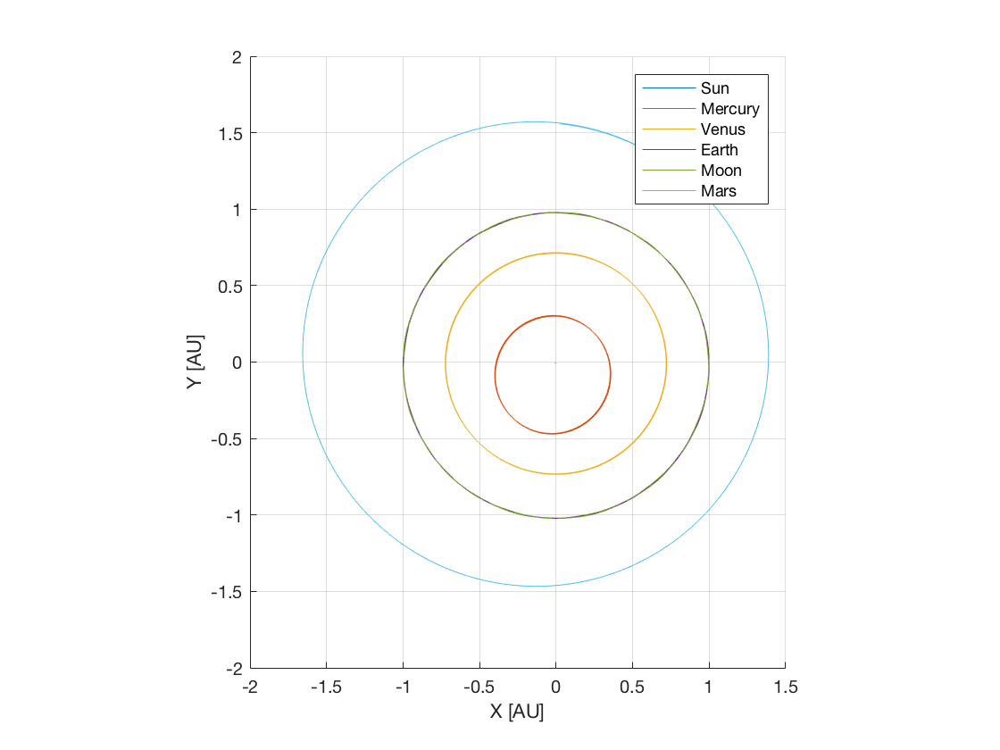

.. _matlabInterface_tutorialsSeamless_innerSolarSystem:

Inner Solar System Propagation
==============================

This tutorial describes how the orbit of the inner Solar system bodies can be propagated using the MATLAB Interface, similar to the example :ref:`walkthroughsInnerSolarSystemPropagation` written in C++. The code for this example can be found at:

.. code-block:: txt

  tudatBundle/matlabInterface/Examples/Seamless/innerSolarSystem.m

The first step is to include the source code of the MATLAB Interface into MATLAB's path in the current session so that all the classes needed to set up the simulation can be accessed. This is done by writing:

.. code-block:: matlab

  tudat.load();

Now, we create a :class:`Simulation` object and specify the initial and final epochs and the global frame orientation:

.. code-block:: matlab

  simulation = Simulation();
  simulation.initialEpoch = 1e7;
  simulation.finalEpoch = simulation.initialEpoch + convert.toSI(2,'y');
  simulation.spice.preloadEphemeris = false;

Note that the function :literal:`toSI` from the :literal:`convert` package has been used to convert 2 years to seconds. In this case, we disable preloading ephemeris of the celestial bodies from Spice, as this is precisely what we are going to propagate.

Next, we create the bodies. There exist predefined objects for celestial bodies (namely the Sun, the Moon and the eight planets), so these objects can be added directly without the need to specify their properties:

.. code-block:: matlab

  simulation.addBodies(Sun,Mercury,Venus,Earth,Moon,Mars);

Now we need to specify the accelerations acting on each body. The accelerations acting on each body are the point-mass gravitational attractions caused by the other bodies. We can define all the accelerations by writing a nested for-loop:

.. code-block:: matlab

  bodyNames = fieldnames(simulation.bodies);
  for i = 1:length(bodyNames)
      for j = 1:length(bodyNames)
          if i ~= j
              accelerations.(bodyNames{i}).(bodyNames{j}) = {PointMassGravity()};
          end
      end
  end
  
Note that the names of the bodies have been retrieved from :literal:`fieldnames(simulation.bodies)`.

Then, we create the settings for the propagation. We are going to propagate the translational state of the celestial bodies. Thus, we use a :class:`TranslationalPropagator`:

.. code-block:: matlab

  propagator = TranslationalPropagator();
  propagator.bodiesToPropagate = bodyNames;
  propagator.centralBodies = repmat({'SSB'},size(bodyNames));
  propagator.accelerations = accelerations;
  simulation.propagators = {propagator};

In this case, we use an hypothetical central body named :literal:`SSB` (Solar system barycentre) for all the celestial bodies. The built-in function :literal:`repmat` is used to create a cell array containing :literal:`'SSB'` repeated six times in this case.

Finally, we define the integrator settings, in this case we use a Runge-Kutta 4 integrator with a fixed step-size of one hour:

.. code-block:: matlab
  
  simulation.integrator.type = Integrators.rungeKutta4;
  simulation.integrator.stepSize = 3600;
  
All the settings needed to run the simulation have been defined. Thus, we can write:

.. code-block:: matlab

  simulation.run();

This method creates a temporary input file and calls the :literal:`json_interface` application, generating a temporary output file containing the state of the satellite for each integration step. Then, it loads these results into the struct :literal:`results` of the :literal:`simulation` object. Finally, all the temporary files are deleted.

After running the simulation, if no specific results have been requested, we can obtain the numerical solution of the equations of motion from :literal:`simulation.results.numericalSolution`. This is a matrix containing in each row the results of an integration step. The first column contains the epochs, while the columns 2 to 7 contain the associated Cartesian states of the first propagated body (the Sun), columns 8 to 13 the Cartesian states of the second propagated body (Mercury), and so on. We can retrieve the positions for each body and save them in the struct :literal:`r` by writing:

.. code-block:: matlab

  for i = 1:length(bodyNames)
      fromIndex = 2 + (i-1)*6;
      toIndex = fromIndex + 2;
      r.(bodyNames{i}) = convert.fromSI(simulation.results.numericalSolution(:,fromIndex:toIndex),'AU');
  end

Note the use of the function :literal:`fromSI` of the :literal:`convert` package, which in this case converts metres to astronomical units.

Finally, we generate a plot showing the positions of the celestial bodies during the propagation period of two years, which yields the orbits of the planets:

.. code-block:: matlab

  figure;
  hold on;
  for i = 1:length(bodyNames)
      bodyPosition = r.(bodyNames{i});
      plot3(bodyPosition(:,1),bodyPosition(:,2),bodyPosition(:,3));
  end
  legend(bodyNames{:});
  axis([-2 2 -2 2 -0.1 0.1]);
  axis equal;
  grid on;
  xlabel('X [AU]');
  ylabel('Y [AU]');
  zlabel('Z [AU]');
  hold off;

