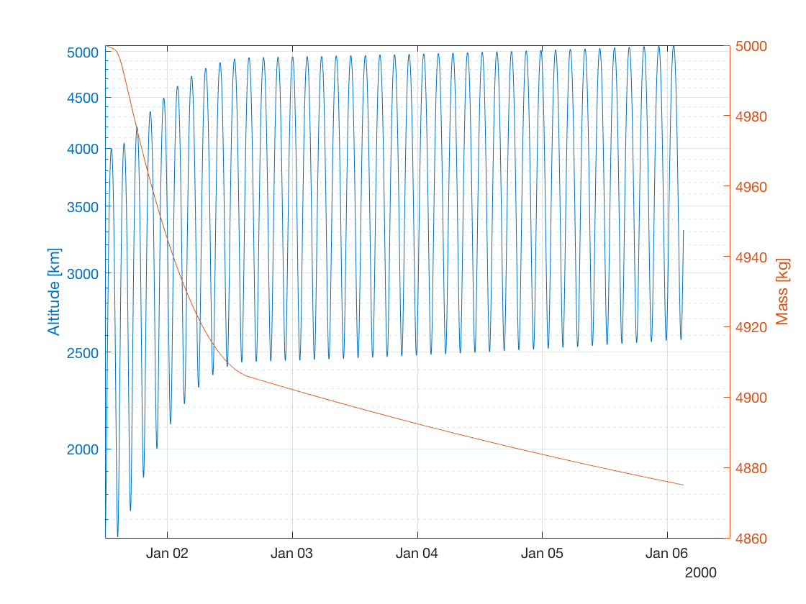

.. _matlabInterface_tutorialsSeamless_thrustAccelerationFromFile:

Thrust vector read from tabulated file
======================================

This tutorial describes how to propagate the orbit of a perturbed satellite about Earth which has a thrust force directed along the velocity vector using the MATLAB Interface, similar to the example :ref:`walkthroughsUseOfThrustUserDefinedThrustVector` written in C++. The code for this example can be found at:

.. code-block:: txt

  tudatBundle/matlabInterface/Examples/Seamless/thrustAccelerationFromFile.m

This example is identical to the one described in :ref:`matlabInterface_tutorialsSeamless_thrustAlongVelocityVector`, the only difference being that instead of creating the thrust force by defining its direction and (constant) magnitude, we provide the components of the thrust vector for several epochs using a tabulated file. This data is then interpolated and used to compute the thrust at each integration step. Thus, the set-up process is not repeated here. The only difference is the part of the code in which the :class:`Thrust` object is created:

.. code-block:: matlab

  thrust = Thrust();
  thrust.dataInterpolation.data = FromFileDataMap('thrustValues.txt');
  thrust.dataInterpolation.interpolator.type = Interpolators.linear;
  thrust.specificImpulse = 3000;
  thrust.frame = ThrustFrames.lvlh;
  thrust.centralBody = Earth;
  accelerationsOnVehicle.vehicle = {thrust};

The file containing the thrust values looks like this:

.. code-block:: txt
  :caption: :class:`tudatBundle/matlabInterface/Examples/Seamless/thrustValues.txt`
  
  0         0     0     5
  6068      0     1     5
  6097      1.0   0     5
  6097.5    0.8   0     5
  6098      0.6   0.1   5
  6099      0.1   0.5   5
  12192     20    10    45
  18288     30    15    40
  1e5       0.4   2.0   3.0
  3.999e5   1.0   1.0   2.0
  4e5       1.1   5.0   1.0

The first column contains the epochs at which the thrust vector changes, while the the columns 2 to 4 contain the components of the thrust in the LVLH frame at each epoch.

After having defined all the setting needed for the propagation, we can write:

.. code-block:: matlab

  simulation.run();

Now we can plot the temporal evolution of the altitude and mass of the body. We compute the altitude using the function :literal:`altitude` of the package :literal:`compute`, which takes as arguments a matrix of Cartesian states (retrieved from columns 2 to 7 of the numerical solution) and the body from which to retrieve the average radius. The mass is retrieved from the eighth column of the numerical solution matrix:

.. code-block:: matlab

  dates = convert.epochToDate(simulation.results.numericalSolution(:,1));
  h = compute.altitude(simulation.results.numericalSolution(:,2:7),Earth);
  m = simulation.results.numericalSolution(:,8);

  figure;
  grid on;
  hold on;

  yyaxis left;
  semilogy(dates,h/1e3);
  ylabel('Altitude [km]');

  yyaxis right;
  plot(dates,m);
  ylabel('Mass [kg]');

