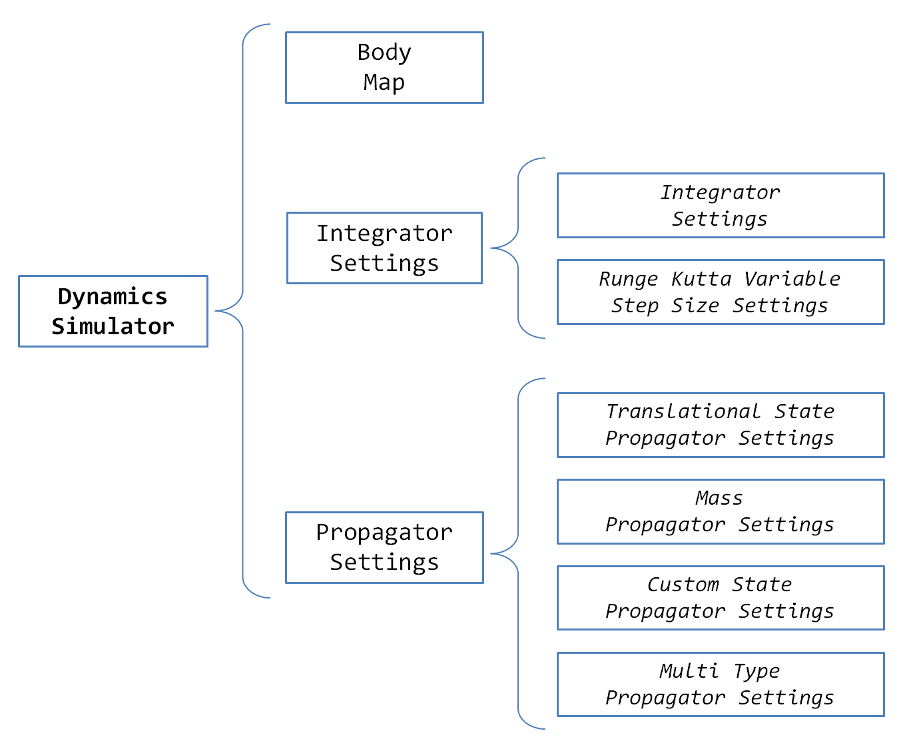

.. _tudatFeaturesSimulatorIndex:

Simulator Set-Up
================

One of the core elements of the Tudat libraries is its simulator framework. The goal of this page is discuss the implementation of such framework as well as the numerous options available. The top-level framework of the simulator is shown below:

The top-element in such framework is the :class:`DynamicsSimulator`, which is in charge of propagating the equations of motion using the environment and acceleration models discussed in :ref:`tudatFeaturesEnvironmentIndex` and :ref:`tudatFeaturesAccelerationIndex`, respectively. The orbit propation is done according to the specified :class:`IntegratorSettings` and the :class:`PropagatorSettings`, which are discussed in detail in :ref:`tudatFeaturesIntegratorSettings` and :ref:`tudatFeaturesPropagatorSettings`.

As shown in the figure above, there are various types of :class:`IntegratorSettings` and :class:`PropagatorSettings` depending on the particularities of the application at hand. The different types are implemented by means of derived classes, as discussed below:

**Integrator Settings**
    - :class:`IntegratorSettings`
        This is the default derived class which is used whenever a fixed-step size integrator is used.
    - :class:`RungeKuttaVariableStepSizeSettings`
        This is a special derived class which takes additional arguments and is used whenever a Runge-Kutta variable step-size integrator is used.

**Propagator Settings**
    - :class:`TranslationalStatePropagatorSettings`
        This derived class defines the settings to propagate the translational dynamics.
    - :class:`MassPropagationSettings`
        This derived class defines the settings to propagate the mass of a body.
    - :class:`CustomStatePropagationSettings`
        This derived class allows the propagation of user-defined dynamics.
    - :class:`MultiTypeProgationSettings`
        This derived class allows to propagate simultaneously the various propagator classes defined above.

The reader is referred to the following sections to examine in detail how to create the dynamics simulator:

.. toctree::

   integratorSettings
   propagatorSettings
   propagatorSettingsTermination
   propagatorSettingsDependentVariables
   simulatorCreation
